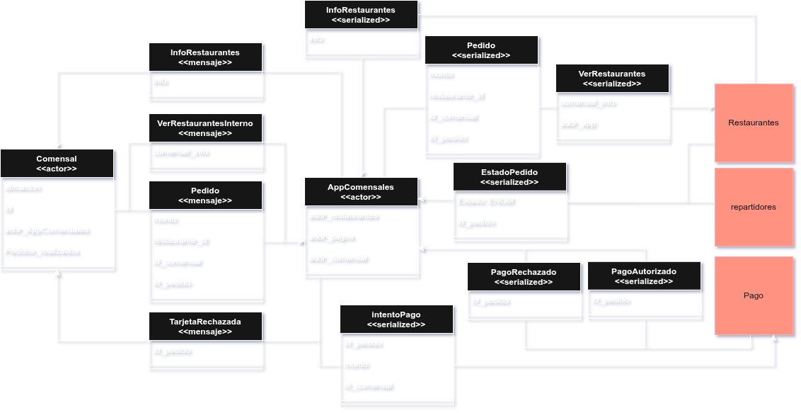
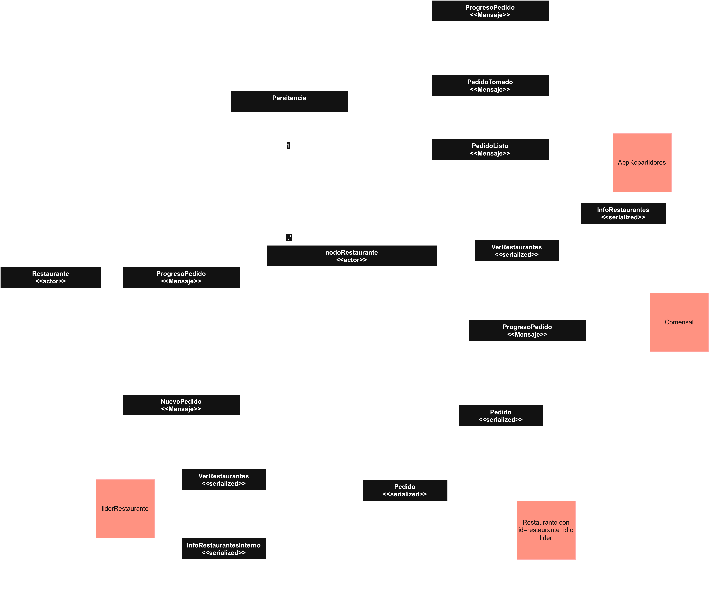
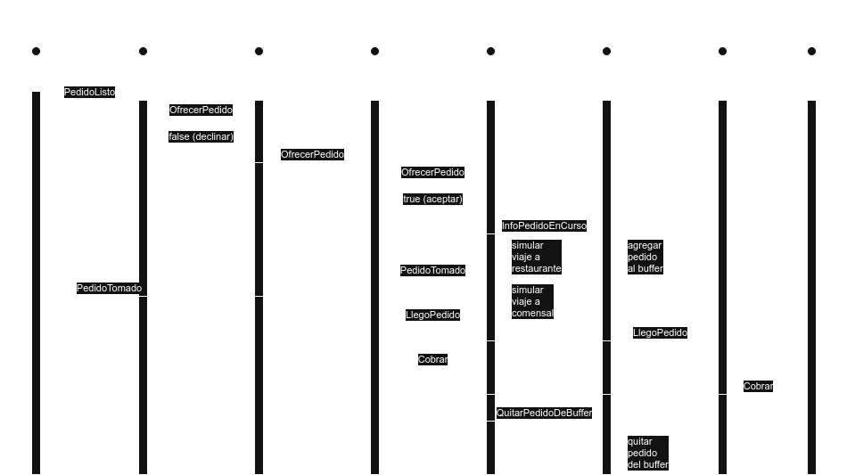

[](https://classroom.github.com/a/YmMajyCa)

# Diseño de la solución

## Aplicación de comensal

### Actores

#### Comensal

- Finalidad general: representa a un usuario que desea realizar pedidos.

- Estado interno:

```rust
pub struct Comensal {
    id: u32,
    ubicacion: Ubicacion,
    nodo_comensal: Option<Addr<NodoComensal>>,
    pedido_realizado: Option<Pedido>,
    logger: Logger,
}
```

- Mensajes que recibe y cómo se comporta:

  - `InfoRestaurantes`: selecciona algún restaurante al azar y hace un nuevo pedido.
  - `PagoRechazado`: hace un sleep y vuelve a pedir la info de restaurantes (`VerRestaurantesInterno`) para hacer otro pedido.
  - `ProgresoPedido`: sólo lo recibe cuando el pedido finalizó, por lo que realiza un sleep y vuelve a pedir la info de los restaurantes para hacer otro pedido.
  - `LLegoPedido`: informa al comensal que el pedido llegó correctamente, luego realiza un sleep y vuelve a pedir la info de los restaurantes para hacer otro pedido.

- Mensajes que envía:

  - `VerRestaurantesInterno`: Envia al NodoComensal para solicitar la información de los restaurantes disponibles.
  - `Pedir`: Envia al NodoComensal, con el restaurante elegido.

#### NodoComensal

- Finalidad general: representa la instancia de la aplicación del comensal. Actúa como intermediario entre el comensal y el resto de aplicaciones.

- Estado interno:

```rust
pub struct NodoComensal {
    ip: SocketAddrV4,
    restaurantes: HashMap<u32, SocketAddrV4>, // id_restaurante -> direccion
    gateway_pagos: SocketAddrV4,
    comensal: Addr<Comensal>,
    logger: Logger,
}
```

- Mensajes que recibe y cómo se comporta:

  - `VerRestaurantesInterno`: envía un `VerRestaurantes` a algún NodoRestaurante al azar. Si no es capaz de enviarlo, vuelve a intentar con otro, hasta que pueda hacerlo.
  - `Pedir`: recibe el pedido del comensal y envía `IntentoPago` a Pagos.
  - `ProgresoPedido`: si el estado es que el pedido fue cancelado o entregado, lo reenvía al comensal para que éste haga un nuevo pedido.
  - `PagoRechazado`: envía `PagoRechazado` a `Comensal` para que éste vuelva a intentar hacer un pedido.
  - `PagoAutorizado`: envía el `Pedido` correspondiente a ese pago a un NodoRestaurante al azar.
  - `InfoRestaurantes`: lo reenvía al `Comensal` con la información de los restaurantes disponibles.
  - `LLegoPedido`: lo reenvia al `Comensal` para informarle que su pedido llegó correctamente.

- Mensajes que envía:

  - `VerRestaurantes`: Envia al NodoRestaurante para obtener la información de los restaurantes disponibles.
  - `Pedir`: Envia el pedido a un NodoRestaurante.
  - `InfoRestaurantes`: Envia al Comensal con la información de los restaurantes disponibles.
  - `IntentoPago`: Envia el pedido al Gateway de Pagos para intentar realizar el pago.
  - `PagoRechazado`: Informa al comensal que el pago fue rechazado y que debe intentar nuevamente.
  - `LLegoPedido`: Informa al comensal que su pedido llegó correctamente.
  - `ProgresoPedido`: Envia el progreso del pedido al comensal.

### Mensajes

```rust
pub struct InfoRestaurantes {
    info_restaurantes: HashMap<u64, Ubicacion>, // id_restaurante -> Ubicacion
}
```

```rust
struct VerRestaurantesInterno {
    info_comensal: InfoComensal,
}
```

```rust
struct Pedir {
    id_pedido: u32,
    monto: f32,
    id_restaurante: u32,
    id_comensal: u32,
}
```

```rust
struct ProgresoPedido {
    id_pedido: u32,
    estado: EstadoPedido,
}
```

```rust
struct PagoRechazado {
    id_pedido: u32,
}
```

```rust
struct PagoAutorizado {
    id_pedido: u32,
}
```

```rust
struct VerRestaurantes {
    info_comensal: InfoComensal,
    addr_app: Ipv4Addr,
}
```

```rust
struct IntentoPago {
    id_pedido: u32,
    monto: f32,
    id_comensal: u32
}
```

```rust
struct TarjetaRechazada {
    id_pedido: u32,
}
```

```rust
struct LLegoPedido {
    id_pedido: u32,
    info_comensal: InfoComensal,
}
```

### Estructuras auxiliares

```rust

pub struct Ubicacion(u32, u32);

pub enum EstadoPedido {
    Pendiente,
    Preparando,
    Listo,
    EnCamino,
    Entregado,
    Cancelado,
}
```

### Casos de interés

- **Ver restaurantes disponibles**:

  1. Cuando el comensal quiere ver los restaurantes disponibles, envía un mensaje `VerRestaurantesInterno` a la aplicación del comensal.

  2. La aplicación del comensal envía un mensaje `VerRestaurantes` a la aplicación de restaurantes, que responde con un mensaje `InfoRestaurantes`.

  3. La aplicación del comensal reenvía este mensaje al comensal.

- **Realizar un pedido**:

  1. Cuando el comensal quiere realizar un pedido, envía un mensaje `Pedido` a la aplicación del comensal.

  2. La aplicación del comensal envía un mensaje `IntentoPago` a la aplicación de pagos, que responde con un mensaje `PagoAutorizado` o `PagoRechazado`.

  3. Si el pago es autorizado, la aplicación del comensal envía un mensaje `Pedido` a la aplicación de restaurantes.

  4. Si el pago es rechazado, la aplicación del comensal envía un mensaje `TarjetaRechazada` al comensal.

### Diagrama de actores y mensajes



### Protocolos

Se utilizará TCP para envío de mensajes y UDP para recepción de mensajes, porque los pedidos pueden culminarse con el comensal caido, no se necesita acuse de recibo de los mensajes que se envían al comensal.

## Aplicación de Restaurantes

### Actores

#### Restaurante

- Finalidad general: representa a un restaurante que recibe pedidos, los envía a repartidores, los procesa y comunica el progreso al comensal.

- Estado interno:

```rust
struct Restaurante {
    id: u32,
    ubicacion: Ubicacion,
    receptor_progreso: Option<Addr<A>>,
    pedidos_recibidos: HashMap<u32, Pedido>,
    cocinas: Vec<Addr<Cocina<Restaurante<A>>>>,
    cantidad_cocinas: usize,
    cocina_proxima: usize,
    logger: Logger,
}
```

- Mensajes que recibe:

  - `ObtenerUbicación`: Tras recibirlo devuelve su ubicación a NodoRestaurante
  - `Pedir`: Recibe el pedido y posteriormente envía `PedidoACocinar` a cocina
  - `PedidoCocido`: Actualiza el estado del pedido y notifica al receptor de progreso con `ProgresoPedido`.
  - `AddrNodo`: Asigna el nodo al restaurante que es contenido en este

- Mensajes que envía:

  - `PedidoACocinar`
  - `ProgresoPedido`

#### Cocina

- Finalidad general: Simula la preparación de los pedidos que le llegan al restaurante.

- Estado interno:

```rust
struct Cocina{
    pedidos: VecDeque<u32>, // Usamos VecDeque para eficiencia al quitar elementos del frente
    cocina_en_uso: bool,
    recepcion: Addr<A>,
}
```

- Mensajes que recibe:

  - `PedidoACocinar`: Comienza a simular la preparación del pedido, y se envía a si mismo `IniciarCoccion`
  - `IniciarCoccion`: Añade el pedido a la cola y empieza a cocinar, cuando termina envía `PedidoCocido` a restaurante

- Mensajes que envía:

  - `PedidoCocido`
  - `IniciarCoccion`

#### NodoRestaurante

- Finalidad general: representa la instancia de la aplicación del restaurante. Actúa como intermediario entre el restaurante y el resto de aplicaciones (repartidores, comensales y los demás restaurantes).

- Estado interno:

```rust
struct NodoRestaurante {
    restaurante: (Addr<Restaurante<NodoRestaurante>>, u32),
    pedidos: HashMap<u32, (SocketAddrV4, Ubicacion)>,
    restaurantes: HashMap<u32, SocketAddrV4>,
    ip_repartidores: Ipv4Addr,
    rango_repartidores: (u16, u16),
    local: SocketAddrV4,
    lider: Option<SocketAddrV4>,
    siguiente: SocketAddrV4,
    anterior: SocketAddrV4,
    rango_nodos: (u16, u16),
    logger: Logger,
}
```

- Mensajes que recibe:

  - `PedidoTomado`: se desliga de la responsabilidad de ese pedido (lo marca como finalizado en el log compartido y lo elimina de entre los pedidos actuales)
  - `Pedir`: Si es el nodo correcto, le envía `Pedir` a `Restaurante`. Si no se reenvia al lider, y se hace llegar al nodo correcto.
  - `ProgresoPedido`: si no es el lider, lo envía al lider. Si es el lider, lo envía al restaurante correspondiente a ese pedido. Si el restaurante lo recibe es porque el pedido se terminó de preparar, por lo que envía `PedidoTomado` al restaurante para tomar el pedido y entregarlo.
  - `InfoRestaurantesInterno` (nodo): envía `InfoRestaurantes` al comensal correspondiente
  - `VerRestaurantes`: si no es el lider, lo reenvia al lider. Si es el lider, calcula los restaurantes cercanos a ese comensal y responde con `InfoRestaurantesInterno` al nodo que se lo envió, o con `InfoRestaurantes` si el comensal le habló directamente.

- Mensajes que envía:

  - `ObtenerUbicacion`
  - `InfoRestaurantes`
  - `InfoRestaurantesInterno`
  - `ProgresoPedido`
  - `Pedir`
  - `PedidoListo`
  - `PedidoTomado`
  - `InfoRestaurantes`
  - `ActualizarSiguiente`
  - `CambiarSiguiente`
  - `RingElection`
  - `KeepAlive`

### Mensajes

```rust
struct Pedir {
    pub id_pedido: u32,
    pub monto: f32,
    pub id_restaurante: u32,
    pub ubicacion_comensal: Ubicacion,
    pub dir_comensal: SocketAddrV4,
}
```

```rust
struct PedidoTomado {
    id_pedido: u32,
    id_restaurante: u32,
}
```

```rust
struct ProgresoPedido {
    id_pedido: u32,
    estado: EstadoPedido,
}
```

```rust
struct PedidoListo {
    id_pedido: u32,
    id_restaurante: u32,
    ubicacion_comensal: Ubicacion,
    ubicacion_restaurante: Ubicacion,
    direccion_comensal: SocketAddr,
}
```

```rust
struct PedidoACocinar {
    id_pedido: u32,
}
```

```rust
struct IniciarCoccion {}
```

```rust
struct InfoRestaurantesInterno {
    pub comensal: SocketAddrV4,
    info_restaurantes: HashMap<u32, Ubicacion>,
    ubicacion_comensal: Ubicacion,
}
```

```rust
struct AddrNodo<A>
where
    A: Actor + Send + 'static,
{
    addr: Addr<A>,
}
```

```rust
pub struct InfoRestaurante {
    id: u32,
    ubicacion: Ubicacion,
}
```

### Casos de interés

- **Procesar pedidos nuevos**:

  1. Cuando llega un `Pedido` nuevo, si el receptor es el destinatario lo procesa, sino lo envia al lider para que lo asigne correctamente
  2. Si el `Restaurante` no esta disponible cuando llega el `Pedido`, el lider avisa al `Comensal` con un `ProgresoPedido` cancelado.
  3. Conforme `Restaurante` procesa los pedidos, envia actualizaciones de `ProgresoPedido` al `Comensal`.
  4. El restaurante envía `PedidoListo` a algún nodo de la app de repartidores para que sea asignado a algún repartidor.

- **Notificar pedidos listos**:

  1. Una vez que el `Pedido` se encuentre listo, se avisa a la aplicación de repartidores.
  2. Espera a recibir `PedidoTomado` para desligarse de la responsabilidad.
  3. En caso de no recibir respuesta, cancela el pedido e informa a `Comensal`.

- **Elección de líder**
  Se utilizará el algoritmo de ring para elección de líder.

- **Log de pedidos de todos los restaurantes**
  Se utilizará commit de dos fases para llevar adelante un log que tenga el progreso de los pedidos de todos los restaurantes. Cada pedido, aparte de toda la información importante, tendrá un timestamp. Cada cierto tiempo, el líder se fijará en los pedidos que están abiertos. Si la antigüedad de ese pedido supera cierto umbral, se comunicará con el restaurante que tiene la responsabilidad de ese pedido. Si el restaurante no está conectado (eso se puede confirmar mediante TCP) el líder cancela el pedido y avisa al comensal.

### Diagrama de actores y mensajes



### Protocolos

Se utilizará TCP para envío y recepción de mensajes.

## Aplicación de repartidores

### Actores

#### Repartidor

- Finalidad general: representa a un repartidor que toma pedidos, los retira por el restaurante y los entrega al comensal.

- Estado interno:

```rust
struct Repartidor {
    ubicacion: Ubicacion,
    pedido_actual: Option<Pedido>,
    restaurante_actual: Option<(u32, Ubicacion)>,
    dir_comensal_actual: Option<SocketAddrV4>,
    nodo_repartidor: Option<Addr<NodoRepartidor>>,
}
```

- Mensajes que recibe:

  - **OfrecerPedido**: si el repartidor no está ocupado y se encuentra a menos de 100 unidades de distancia del restaurante,
    tiene un 75% de probabilidad de aceptar el pedido, respondiendo true en el handler. Una vez que acepta el pedido,
    comienza a simular el viaje al restaurante, y luego al comensal. Al llegar al restaurante, envía `PedidoTomado` a su
    `NodoRepartidor`, para que éste lo reenvíe al restaurante. Al llegar al comensal, envía `LlegoPedido` y `Cobrar` al
    `NodoRepartidor`, que los reenvía al comensal y al gateway de pagos, respectivamente.
  - **InfoPedidoEnCurso**: actualiza la información relacionada al pedido actual.

- Mensajes que envía:

  - `PedidoTomado`
  - `LlegoPedido`
  - `Cobrar`

#### NodoRepartidor

- Finalidad general: representa la instancia de la aplicación de repartidor. Actúa como intermediario entre el repartidor y el resto de aplicaciones y de nodos de repartidores.

- Estado interno:

```rust
pub struct NodoRepartidor {
    repartidor: Addr<Repartidor>,
    pagos: SocketAddrV4,
    local: SocketAddrV4,
    lider: Option<SocketAddrV4>,
    siguiente: SocketAddrV4,
    anterior: SocketAddrV4,
    rango_nodos: (u16, u16),
    id_pedido_actual: Option<u32>,
    ip_restaurantes: Ipv4Addr,
    rango_restaurantes: (u16, u16),
    anillo_actual: Vec<u16>,
    pedidos_en_curso: Vec<InfoRepartidorPedido>,
    logger: Logger,
}
```

- Mensajes que recibe:

  - `PedidoListo`: El nodo recibe un pedido listo. Intenta ofrecerlo a su repartidor local. Si el repartidor acepta, el nodo envía `InfoPedidoEnCurso` al líder. Si el repartidor no lo acepta, el nodo reenvía el `OfrecerPedido` al siguiente nodo en el anillo. Si no hay un líder, inicia una elección de líder.
  - `OfrecerPedido`: El nodo intenta asignar el pedido a su repartidor. Si el repartidor lo acepta, el nodo envía `InfoPedidoEnCurso` al líder. Si no, reenvía el `OfrecerPedido` al siguiente nodo en el anillo. Si no hay un líder, inicia una elección de líder.
  - `RingElection`: Maneja la elección de líder. Si es de tipo `Election`, agrega el puerto del nodo al mensaje y lo reenvía. Si es de tipo `Coordinator`, establece el líder y actualiza el anillo de nodos. Si era el líder y hay un nuevo líder, envía los `InfoRepartidorPedido` que tiene en el buffer al nuevo líder.
  - `ActualizarSiguiente`: Busca el siguiente nodo disponible en el anillo y actualiza su referencia.
  - `KeepAlive`: Si no es del nodo que tenía almacenado como anterior, reenvía el mensaje `CambiarSiguiente` al nodo que tenía como anterior para que "apunte" al nuevo nodo, y envía `SolicitarPedidoEnCurso` al líder pidiéndole que le pase al nuevo nodo el pedido que tenía en curso cuando se desconectó (si es que estaba ocupado y no fue cancelado por antigüedad).
  - `CambiarSiguiente`: Actualiza el siguiente nodo en el anillo.
  - `InfoRepartidorPedido`: Si es el líder, agrega la información del pedido a su lista de pedidos en curso. Si no es el líder, reenvía el mensaje al líder.
  - `InfoPedidoEnCurso`: Actualiza la información relacionada al pedido en curso.
  - `SolicitarPedidoEnCurso`: Si tiene un pedido en curso para el emisor, le envía un mensaje `InfoPedidoEnCurso` con la información.
  - `PedidosEnCursoRepartidores`: Actualiza la lista de pedidos en curso del nodo (solo el líder recibe este mensaje).
  - `QuitarPedidoDeBuffer`: Elimina un pedido del buffer de pedidos en curso.
  - `PedidoTomado`: reenvía el mensaje a algún restaurante.
  - `Cobrar`: reenvía el mensaje al gateway de pagos, y envía `QuitarPedidoDeBuffer` al líder.

- Mensajes que envía:

  - `OfrecerPedido`
  - `Cobrar`
  - `LlegoPedido`
  - `PedidoTomado`
  - `ActualizarSiguiente`
  - `RingElection`
  - `CambiarSiguiente`
  - `InfoPedidoEnCurso`
  - `PedidosEnCursoRepartidores`
  - `QuitarPedidoDeBuffer`
  - `KeepAlive`
  - `SolicitarPedidoEnCurso`
  - `ProgresoPedido` (en caso de cancelación)

### Mensajes

```rust
struct AceptarPedido {
    id_pedido: u32,
    id_repartidor: u32,
}
```

```rust
struct Cobrar {
    id_pedido: u32,
}
```

```rust
struct LlegoPedido {
    id_pedido: u32,
    direccion_comensal: SocketAddr,
}
```

```rust
struct OfrecerPedido {
    pedido: PedidoListo,
}
```

```rust
struct PedidoListo {
    id_pedido: u32,
    info_comensal: InfoComensal,
    info_restaurante: InfoRestaurante,
    direccion_comensal: SocketAddr,
}
```

```rust
struct PedidoTomado {
    id_pedido: u32,
    id_restaurante: u32,
}
```

```rust
struct InfoPedidoEnCurso {
    dir_comensal: SocketAddrV4,
    pedido: Pedido,
    info_restaurante: Option<(u32, Ubicacion)>,
}
```

```rust
struct InfoRepartidorPedido {
    id_pedido: u32,
    dir_repartidor: SocketAddrV4,
    dir_comensal: SocketAddrV4,
    pedido: Pedido,
    info_restaurante: Option<(u32, Ubicacion)>,
    timestamp: i64,
}
```

```rust
struct PedidosEnCursoRepartidores {
    pedidos: Vec<InfoRepartidorPedido>,
}
```

```rust
struct QuitarPedidoDeBuffer {
    id_pedido: u32,
}
```

```rust
struct RingElection {
    tipo: u8,
    puerto_original: u16,
    puertos: Vec<u16>,
}
```

```rust
struct KeepAlive {
    dir_emisor: SocketAddrV4,
}
```

```rust
struct CambiarSiguiente {
    siguiente: SocketAddrV4,
}
```

```rust
struct ActualizarSiguiente {}
```

```rust
struct SolicitarPedidoEnCurso {
    dir_emisor: SocketAddrV4,
}
```

### Casos de interés

- **Solicitar pedido**:

1. Cuando un `PedidoListo` llega a un `NodoRepartidor`, este envía `OfrecerPedido` a su repartidor. Si el repartidor acepta el pedido,
   el nodo envía `InfoPedidoEnCurso` al líder para que guarde ese pedido en su buffer.

2. El repartidor recibe el `OfrecerPedido` y, si no está ocupado y está cerca del restaurante, tiene un 75% de probabilidad de aceptarlo.

3. Si el repartidor no acepta el pedido (ya sea por estar ocupado, lejos o por probabilidad), el `NodoRepartidor` reenvía el `OfrecerPedido` al siguiente nodo en el anillo para que otro repartidor pueda tomarlo. Esto se repite hasta que algún repartidor acepta o se cancela el pedido.

- **Repartir pedido**

  1. Cuando el repartidor acepta un `OfrecerPedido`, comienza a simular el viaje al restaurante. Cuando llega, envía `PedidoTomado` a su `NodoRepartidor` para que este lo reenvíe al restaurante. El restaurante, al recibir `PedidoTomado`, se desliga de la responsabilidad del pedido.

  2. Luego, el repartidor simula el viaje hasta el comensal. Al llegar, envía `LlegoPedido` al `NodoRepartidor` (que lo reenvía al comensal) y `Cobrar` también al `NodoRepartidor` (que lo reenvía a la App de Pagos).

3. Finalmente, el repartidor se desocupa. Si el nodo no es el líder, envía `QuitarPedidoDeBuffer` al líder para que elimine el pedido de su lista de pedidos en curso.

### Diagrama de secuencia


