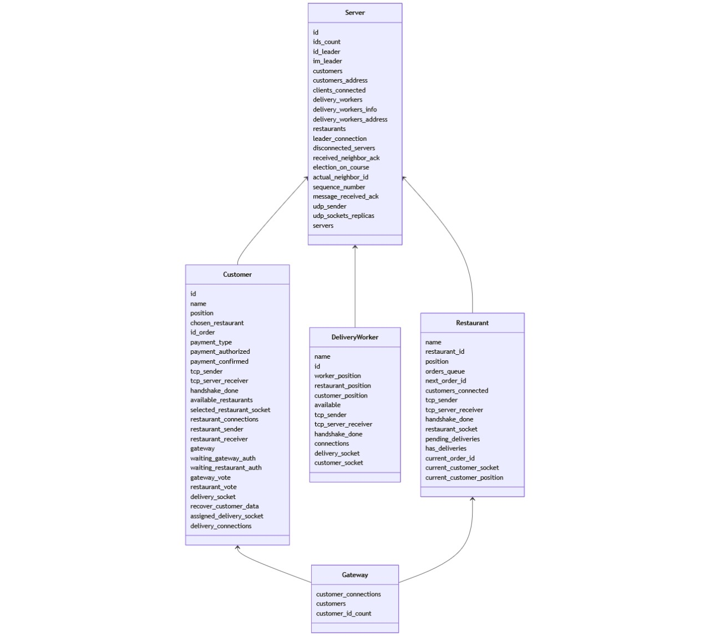

[](https://classroom.github.com/a/YmMajyCa)

# INFORME - PRIMERA ENTREGA

## Diseño General de Componentes

El sistema implementado está compuesto hasta el momento por un servidor, N clientes, M restaurantes y R repartidores. Además. se cuenta con un único gateway de pagos, al cual los clientes "customers" se vinculan para pagar sus pedidos.

El servidor es el intermediario entre el los agentes: clientes, restaurantes y repartidores. Estos, antes de que el cliente realice un pedido, no están conectados entre sí. Comienzan a contactarse luego de haber realizado una orden.

El sistema se inicia levantando primero y principal al servidor. Luego, cada cliente, restaurante y repartidor se conectan al servidor, indicando su IP y puerto. Una vez que el servidor tenga esta información sobre ellos, almacena sus datos y va a permitir que se comuniquen entre ellos.


Se adjunta a continuación un diagrama con los componentes de la aplicación:


## Diagrama de entidades


## Diagrama de threads

### Customer


### Gateway


### Restaurant


### Delivery worker


### Server


## Server

Este Actor actua como coordinador central, y se encarga de almacenar y actualizar la información sobre los clientes conectados a la red, ya sean customers, repartidores o restaurantes. Además, es quien centraliza el envio de información sobre estos clientes conectados.

### Estado Interno y Mensajes

Contamos con Actor Server que contiene los siguientes parámetros:

***Estado Interno***
```rs
pub struct Server {
    ///Clientes de tipo Costumers con su ID, segun su nombre
    pub customers: HashMap<String, u64>,
    ///Conexion TCP con cada Customer, segun su ID
    pub customers_address: HashMap<u64, Addr<TcpSender>>,
    ///contador de clientes conectados para saber que ids asignarles
    pub clients_connected: u64,
    ///Clientes de tipo Restaurant con su ID
    pub restaurants: Vec<u64>,
    ///Conexion TCP con cada Restaurant, segun su ID
    pub restaurants_address: HashMap<u64, Addr<TcpSender>>,
    ///Clientes de tipo DeliveryWorker con su ID
    pub delivery_workers: Vec<u64>,
    ///Conexion TCP con cada DeliveryWorker, segun su ID
    pub delivery_workers_address: HashMap<u64, Addr<TcpSender>>,
}
```
El TcpSender tambien es un actor, contenido adentro del actor Server. Representa una conexión activa con un cliente, que puede ser un customer, un restaurante o un repartidor. Es quien se encarga estrictamente de recibir los mensajes del Server y enviar mensajes TCP a un cliente en especifico.

```rs
pub struct TcpSender {
    ///canal de escritura hacia el cliente conectado
    pub write: Option<WriteHalf<TcpStream>>,
    ///address (direccion IP y puerto) del cliente
    pub addr: SocketAddr,
    ///address del server para poder enviarle mensajes
    pub server_addr: Addr<Server>,
}
```
El TcpSender deserializa mensajes TCP que escucha de los clientes, y se los envía al mailbox del actor Server como un 
`actix::Message`. Haciendo esta distinción de responsabilidad logramos que el servidor, siendo el actor principal sea quien decide qué se hace con un mensaje de un cliente (responderle, actualizar su estado interno, reenviarlo, etc.)

Los mensajes que recibe y envía el TcpSender tienen el siguiente formato:

```rs
pub struct TcpMessage(pub String);
```

Dado que la comunicacion entre el Server y todos los clientes de la red es por TCP, el encargado de deserializar e interpretar los mensajes TCP es el TcpSender del servidor. Este, dado un string, le va a enviar el mensaje correspondiente al actor del Server.

Un mensaje comun a todos los clientes que se conectan al servidor es:
```rs
    pub struct HandshakeReceived;
```
que indica que, una vez que el cliente se intentó conectar al servidor, este le contesta a traves del TcpSender para informarle que recibió su pedido. En cadena, los clientes le envían un ACK al servidor para terminar de entablar el Three-Way-Handshake de TCP.


#### ***Mensajes que recibe el Server***

| Remitente      | Nombre del mensaje | Estructura del mensaje                                                                                                   | Descripción                                                                                                     |
|----------------|--------------------|--------------------------------------------------------------------------------------------------------------------------|-----------------------------------------------------------------------------------------------------------------|
| Customer       | OrderInformation   | {<br/>customer_id,<br/>order_id,<br/>total_price,<br/>customer_position,<br/>restaurant_position,<br/>payment_type<br/>} | Es el mensaje que envía el comensal con toda la información del pedido                                          |
| DeliveryWorker | AcceptOrder        | {<br/>delivery_worker_id,<br/>order_id,<br/>restaurant_id,<br/>customer_id<br/>}                                         | Es el mensaje que envía el repartidor para aceptar entregar el pedido                                           |
| Restaurant     | OrderState         | {<br/>customer_id,<br/>order_id,<br/>restaurant_id,<br/>order_status<br/>}                                               | Es el mensaje que envía el restaurante al comensal informando el estado del pedido                              |
| DeliveryWorker | DeliveryState      | {<br/>customer_id,<br/>order_id,<br/>delivery_worker_id,<br/>order_status<br/>}                                          | Es el mensaje que envía el delivery para indicar el estado de la entrega del pedido para informarle al comensal |

#### ***Mensajes que envía el Server***

| Destinatario   | Nombre del mensaje | Estructura del mensaje                                                                                                     | Descipción                                                                                                    |
|----------------|--------------------|----------------------------------------------------------------------------------------------------------------------------|---------------------------------------------------------------------------------------------------------------|
| Customer       | OrderState         | {<br/>customer_id,<br/> order_id,<br/>restaurant_id,<br/> order_status<br/>}                                               | Es el mensaje que envia el restaurante al comensal informando el estado del pedido                            |
| Restaurant     | OrderReceived      | {<br/>customer_id,<br/>order_id,<br/>order_status,<br/>position_customer<br/>}                                             | Es el mensaje que envia al restaurante que contiene toda la información del pedido y del comensal             |
| DeliveryWorker | AssignDelivery     | {<br/>customer_id,<br/>order_id,<br/>restaurant_id,<br/>order_status,<br/>position_restaurant,<br/>position_customer<br/>} | Es el mensaje que se envia a todos los repartidores cercanos para que uno de ellos tome y entregue el pedido |
| Customer       | DeliveryState      | {<br/>customer_id,<br/>order_id,<br/>delivery_worker_id,<br/>order_status<br/>}                                            | Es el mensaje que envia el repartidor al comensal indicando el estado de la entrega del pedido                |

#### Manejo de la Concurrencia

Se plantea como propuesta implementar un servidor líder y un conjunto de servidores réplicas conectados al mismo que estén atentos para tomar la posta en el manejo del servicio en caso de que se caiga el servidor líder.

Por el momento, la aplicación cuenta con un único servidor. Una vez presentado el desarrollo final la idea es que se cuente con los servidores réplica para que en caso de que el servidor líder no esté disponible (por ejemplo por alguna falla o caída), se inicialice un algoritmo para una nueva elección de líder entre los servidores réplicas. De esta forma, al asumir el rol no tenemos una caída completa del sistema y podemos seguir brindando servicio a los clientes.

Los servidores réplicas recibirán información del servidor lider y almacenan el estado del sistema actual, para que, en caso de que sean elegidos como lider luego de ejecutar el algoritmo de elección puedan continuar proviendo servicio según el estado en el que se encontraba el sistema antes de la caída.


## Clientes - Customers

### ***Finalidad general***
Permite al usuario crear un pedido y recibe notificaciones del estado del pedido hasta que lo recibe.

### ***Estado interno***
Los clientes (customers) se componen de:
```rs
pub struct Customer {
    pub id: u64,
    pub name: String,
    pub position: (u32, u32),
    // posición del restaurante elegido para su pedido
    pub chosen_restaurant: Option<(u32, u32)>,
    pub id_order: u32,
    // tipo de pago elegido (efectivo o tarjeta)
    pub payment_type: PaymentType,
    // sender para comunicartse con el servidor
    pub tcp_sender: Addr<TcpSender>,
    pub tcp_server_receiver: Option<Addr<TcpReceiver>>,
    pub handshake_done: bool,
}
```

### ***Mensajes que recibe***
| Nombre del mensaje | Estructura del mensaje                                                          | Reacción                                                |
|--------------------|---------------------------------------------------------------------------------|---------------------------------------------------------|
| Login              | {name}                                                                          | El proceso pide por input que se loguee                 |
| PaymentAuthorized  | {status}                                                                        | Sino, espera notificaciones sobre el estado del pedido  |
| PaymentDenied      | {status}                                                                        | Si el pago es rechazado, vuelve a realizar el pedido.   |
| OrderState         | {<br/>customer_id,<br/>order_id,<br/>restaurant_id,<br/>order_status<br/>}      | Imprime por pantalla el estado del pedido               |
| DeliveryState      | {<br/>customer_id,<br/>order_id,<br/>delivery_worker_id,<br/>order_status<br/>} | Imprime por pantalla el estado de la entrega del pedido |

### ***Mensajes que envía***
| Nombre del mensaje | Estructura del mensaje                                                                                                   | Destinatario |
|--------------------|--------------------------------------------------------------------------------------------------------------------------|--------------|
| GetRestaurants     | {<br/>customer_id,<br/>customer_position<br/>}                                                                           | Server       |
| CreateOrder        | {<br/>customer_id,<br/>order_id,<br/>total_price,<br/>customer_position,<br/>restaurant_position,<br/>payment_type<br/>} | Server       |
| Login              | {name}                                                                                                                   | Gateway      |

### ***Casos de interés***
Casos de caída:
Si el cliente se cae durante la autorización del pago, este se aborta y se descarta el pedido.
Si el cliente se cae luego de hacer el pedido, se reserva el pedido por un determinado tiempo. Si el comensal no se conecta para entonces, el pedido se descarta.
Lo mismo ocurriría si se cae mientras la entrega está en proceso.

## Restaurantes

### ***Finalidad general***
Recibe varios pedidos, que puede aceptar hacer o no, y los va cocinando de manera concurrente, notificando a cada comensal el estado de su respectivo pedido.

### ***Estado interno***
```rs
pub struct Restaurant {
    pub restaurant_id: u64,
    pub position: (u64, u64),
    pub orders: Vec<Order>,
    // sender para comunicartse con el servidor
    pub tcp_sender: Addr<TcpSender>,
    pub handshake_done: bool,
}
```

### ***Mensaje que recibe***
| Nombre del mensaje | Estructura del mensaje                                                     | Reacción                                                                                    |
|--------------------|----------------------------------------------------------------------------|---------------------------------------------------------------------------------------------|
| OrderReceived      | {<br/>customer_id,<br/>order_id,<br/>restaurant_id,<br/>order_status<br/>} | Mediante un random o por input verifica si acepta o rechaza el pedido                       |
| OrderPickedup      | {<br/>order_id,<br/>order_status<br/>}                                     | Termina el hilo que esta manejando el pedido, y borra el pedido de la lista del restaurante |

### ***Mensaje que envía***
| Nombre del mensaje | Estructura del mensaje                                                        | Destinatario |
|--------------------|-------------------------------------------------------------------------------|--------------|
| OrderState         | {<br/>customer_id,<br/>order_id,<br/>restaurant_id,<br/>order_status<br/>}    | Server       |
| ReadyToPickup      | {<br/>customer_id,<br/>order_id,<br/>restaurant_id,<br/>order_status<br/>}    | Server       |

### ***Casos de ínteres***
Caso de caída:
Si se cae el restaurant mientras tiene pedidos activos, se cancelan y el server informa a los comensales de dicha cancelación.

## Repartidores

### ***Finalidad general***
Recibe ofertas de delivery donde puede aceptarlas o no. En caso de aceptarlas, busca el pedido correspondiente y realiza la entrega, notificando al comensal el estado de la misma.

### ***Estado interno***
```rs
pub struct DeliveryWorker {
    pub id: u64,
    pub worker_position: (u64, u64),
    // Indica si esta disponible para entregar un pedido
    pub available: bool,
    // sender para comunicartse con el servidor
    pub tcp_sender: Addr<TcpSender>,
    pub handshake_done: bool,
}
```

### ***Mensaje que recibe***
| Nombre del mensaje | Estructura del mensaje                                                                                    | Reacción                                                                                    |
|--------------------|-----------------------------------------------------------------------------------------------------------|---------------------------------------------------------------------------------------------|
| AvailableOrder     | {<br/>customer_id,<br/>order_id,<br/>restaurant_id,<br/>customer_position,<br/>restaurant_position<br/>}  | Imprime por pantalla los datos del pedido y decide si lo acepta o rechaza mediante un input |

### ***Mensaje que envía***
| Nombre del mensaje | Estructura del mensaje                                                           | Destinatario |
|--------------------|----------------------------------------------------------------------------------|--------------|
| GoingToPickup      | {<br/>delivery_worker_id,<br/>order_id,<br/>restaurant_id,<br/>customer_id<br/>} | Server       |
| DeliveryState      | {<br/>customer_id,<br/>order_id,<br/>delivery_worker_id,<br/>order_status<br/>}  | Server       |

### ***Casos de interés***
Casos de caída:
Si el repartidor se cae cuando está yendo al restaurante, se asigna a otro repartidor.
Si el repartidor se cae cuando está llevando el pedido, se cancela el pedido.

## Gateway

### ***Finalidad general***
Permite que los usuarios se logueen para autorizar sus pagos. Pueden ser aceptados o rechazados

### ***Estado Interno***
```rs
pub struct Gateway {
    // Indica si el pago fue autorizado o no
    pub payment_state: bool,
    // sender para comunicartse con el servidor
    pub tcp_sender: Addr<TcpSender>,
    pub handshake_done: bool,
}
```

### ***Mensajes que recibe***
| Nombre del mensaje    | Estructura del mensaje | Reacción                                                   |
|-----------------------|------------------------|------------------------------------------------------------|
| AuthorizationReceived | {customer_name}        | Mediante un random, verifica si autoriza o rechaza el pago |

### ***Mensajes que envía***
| Nombre del mensaje | Estructura del mensaje | Destinatario |
|--------------------|------------------------|--------------|
| LoginCustomer      | {customer_id}          | Customer     |
| PaymentState       | {payment_state}        | Customer     |

# INFORME - ENTREGA FINAL
## Diseño General de Componentes


## Diagrama de entidades


## Server

### ***Finalidad general***
Este Actor actua como coordinador central, y se encarga de almacenar y actualizar la información sobre los clientes conectados a la red, ya sean customers, repartidores o restaurantes. Además, es quien centraliza el envio de información sobre estos clientes conectados.

### ***Estado interno***
```rs
pub struct Server {
    ///id de el server particular
    pub id: u64,
    ///cantidad de usuarios conectados
    pub ids_count: u64,
    ///id de su server lider
    pub id_leader: u64,
    ///determina si es lider o no
    pub im_leader: bool,
    ///informacion de los comensales
    pub customers: HashMap<String, u64>,
    ///conexion Tcp para comunicarse con los comensales
    pub customers_address: HashMap<u64, Addr<TcpSender>>,
    ///contador de clientes conectados para saber que ids asignarles
    pub clients_connected: u64,
    ///Clientes de tipo DeliveryWorker con su ID
    pub delivery_workers: Vec<u64>,
    ///datos de un delivery para comunicarselos a otros actores
    pub delivery_workers_info: Vec<DeliveryInfo>,
    ///Conexion TCP con cada DeliveryWorker, segun su ID
    pub delivery_workers_address: HashMap<u64, Addr<TcpSender>>,
    pub restaurants: HashMap<String, RestaurantData>,
    /// Conexion con el lider. Es None en caso de ser el lider.
    pub leader_connection: Option<Addr<ServerConnection>>,
    /// Listado de servers desconectados
    pub disconnected_servers: Vec<u64>,
    /// Booleano indicando si se recibio el ACK del vecino
    pub received_neighbor_ack: bool,
    /// Booleano indicando si hay una eleccion de lider en curso
    pub election_on_course: bool,
    /// ID del vecino actual
    pub actual_neighbor_id: u64,
    /// Numero de secuencia actual
    pub sequence_number: u64,
    /// Booleano que indica si se recibio ACK para un numero de secuencia
    pub message_received_ack: HashMap<u64, bool>,
    ///Sender para comunicarse con los otros servidores
    pub udp_sender: Option<Addr<UdpSender>>,
    ///socket con las direcciones de los servidores replica
    pub udp_sockets_replicas: HashMap<u64, String>,
    ///canales de comunicacion entre los servers
    pub servers: HashMap<u64, Addr<TcpSender>>,
}
```

### ***Mensajes que Recibe***

```rs
#[derive(Message, Debug)]
#[rtype(result = "()")]
/// Mensaje cuando un customer se conecta a la aplicacion, anunciando sus datos y posicion para registrar su loggueo
pub struct CustomerConnected {
    /// Nombre del customer
    pub name: String,
    /// Address del actor del TcpSender del customer
    pub addr: Addr<TcpSender>,
}
```

```rs
#[derive(Message)]
#[rtype(result = "()")]
/// Mensaje cuando un delivery se conecta a la aplicacion, anunciando sus datos y posicion para registrar su loggueo
pub struct DeliveryWorkerConnected {
    pub name: String,
    pub addr: Addr<TcpSender>,
}
```

```rs
#[derive(Message, Debug)]
#[rtype(result = "()")]
///Mensaje recibido desde el tcp sender del Server y enviado al actor Server para registrar al restaurante.
pub struct NewRestaurant {
    pub socket: String,
    pub name: String,
    pub position: (u64, u64),
}
```

```rs
#[derive(Message, Debug)]
#[rtype(result = "()")]
///Mensaje recibido desde el tcp sender del Server para obtener informacion de los restaurantes disponibles. Le reenvia a un cliente los restaurantes en su zona.
pub struct GetRestaurants {
    pub _customer_id: u64,
    pub position: (u64, u64),
    pub addr: Addr<TcpSender>,
}
```

```rs
#[derive(Message, Debug)]
#[rtype(result = "()")]
/// El repartidor se registra mandando su posición y socket
pub struct RegisterDelivery {
    pub position: (u64, u64),
    pub socket: String,
    pub sender_addr: Addr<TcpSender>,
}
```

```rs
#[derive(Message, Debug)]
#[rtype(result = "()")]
///Mensaje que le envia un restaurante para solicitarle deliveries disponibles para entregar un pedido en su zona
pub struct GetDeliveries {
    pub id: u64,
    pub position: (u64, u64),
    pub addr: Addr<TcpSender>,
}
```

```rs
#[derive(Message, Serialize, Debug)]
#[rtype(result = "()")]
///Recibe este mensaje de parte de un restaurante para solicitar un delivery, y se lo reenvia a los deliveries en zona. 
pub struct RequestDelivery {
    pub delivery_id: u64,
    pub order_id: u64,
    pub restaurant_position: (u64, u64),
    pub customer_position: (u64, u64),
}
```

```rs
#[derive(Message, Debug, Serialize)]
#[rtype(result = "()")]
///Recibido por parte de un delivery, quien actualiza su estado como ocupado, para que el server lo registre y no envie los datos del delivery al restaurante
pub struct BusyDeliveryWorker {
    pub id: u64,
}
```

```rs
#[derive(Message, Debug, Serialize)]
#[rtype(result = "()")]
///Recibido por parte de un delivery, quien actualiza su estado como disponible, para que el server lo registre como habilitado para hacer otros pedidos.
pub struct FreeDeliveryWorker {
    pub id: u64,
    pub position: (u64, u64),
    pub socket: String,
}
```
```rs
#[derive(Message, Debug)]
#[rtype(result = "()")]
pub struct Pong {
    pub addr: Addr<TcpSender>,
}
```

```rs
#[derive(Message, Debug, Serialize, Clone)]
#[rtype(result = "()")]
///Indica que se llevara a cabo la eleccion de un nuevo lider
pub struct Election {
    /// ID del líder que se cayó.
    pub disconnected_leader_id: u64,
    /// Listado de IDs de servidores réplicas conectados
    pub server_ids: Vec<u64>,
    /// Número de secuencia del mensaje.
    pub sequence_number: u64,
}
```

```rs
#[derive(Message)]
#[rtype(result = "()")]
/// Mensaje que representa el pedido el envio de un
/// mensaje UDP.
pub struct SendMessage {
    pub message: String,
    pub addr: String,
}
```
```rs
#[derive(Message, Debug, Serialize, Clone)]
#[rtype(result = "()")]
///Mensaje que comuncia a otras replicas que se la seleccionado un nuevo lider, indicandole a quien deben conectarse
pub struct NewLeader {
    /// ID del server que determinó el nuevo líder.
    pub id_sender: u64,
    /// ID del nuevo líder.
    pub leader_id: u64,
    /// Número de secuencia.
    pub sequence_number: u64,
}
```
```rs
#[derive(Message, Debug)]
#[rtype(result = "()")]
/// Representa un ACK de una réplica vecina.
pub struct NeighborAck {
    /// ID de la réplica
    pub id: u64,
    /// Mensaje al cual corresponde el ACK
    pub message: String,
    /// Numero de secuencia
    pub sequence_number: u64,
}
```
```rs
#[derive(Message, Debug)]
#[rtype(result = "()")]
/// Mensaje para indicar que se desató una elección de líder.
pub struct StartElection {}
```
```rs
#[derive(Message, Debug)]
#[rtype(result = "()")]
/// Mensaje enviado al servidor cuando se recibe una nueva conexión de otro servidor (replica)
pub struct NewServerConnection {
    /// Address del actor TcpSender
    pub addr: Addr<TcpSender>,
    /// Socket de la conexión (IP y puerto).
    pub socket: String,
    /// Id de la conexión.
    pub id: u64,
}
```
```rs
#[derive(Message, Debug, Clone)]
#[rtype(result = "()")]
///Se le informa a una replica que se ha seleccionado como nuevo ldier, frente a una caida y deben establecer la comunicacion con el nuevo lider.
pub struct SetLeader {
    pub id_leader: u64,
    pub leader_connection: Addr<ServerConnection>,
}
```
```rs
#[derive(Message, Debug)]
#[rtype(result = "()")]
///Detiene la ejecucion del Server
pub struct Stop {}
```

### ***Mensajes que Envía***
```rs
#[derive(Message, Debug, Clone)]
#[rtype(result = "()")]
///Actualizar la dirección del socket de un restaurante en el sistema (por ejemplo, si se reconectó o cambió de puerto/IP).
pub struct UpdateRestaurantSocket {
    pub socket: String,
    pub name: String,
}
```
```rs
#[derive(Message, Debug)]
#[rtype(result = "Result<(), String>")]
///EAnviado desde un servidor replica al ldier, para chequear su conectividad.
pub struct Ping {}
```
```rs
#[derive(Message, Debug)]
#[rtype(result = "()")]
///Mensaje enviado por el líder a otras réplicas, para informarles su dirección.
pub struct SendLeaderId {
    pub addr: String,
}
```
```rs
#[derive(Message, Debug, Clone)]
#[rtype(result = "()")]
///Mensaje interno de control que envía una réplica para verificar si un mensaje enviado a otra réplica fue acknowledgeado (ACK)
pub struct CheckIfNeighborAcked {
    /// ID de la réplica a quien le envíe un mensaje
    pub neighbor_id: u64,
    /// Mensaje que envié
    pub serialized_msg: String,
    /// Numero de secuencia.
    pub sequence_number: u64,
}
```
```rs
#[derive(Message, Debug)]
#[rtype(result = "()")]
/// Mensaje para esperar por un ACK de una réplica.
pub struct WaitForNeighborAck {
    /// Mensaje que envíe a la réplica
    pub serialized_msg: String,
    /// ID de la réplica
    pub neighbor_id: u64,
    /// Numero de secuencia del mensaje
    pub sequence_number: u64,
}
```
```rs
#[derive(Message, Debug)]
#[rtype(result = "()")]
///Mensaje enviado por un servidor replica al lider indicando que quiere conectarse.
pub struct ConnectToServer {}
```

```rs
#[derive(Message, Debug, Serialize)]
#[rtype(result = "()")]
///Actualiza enviada del lider a las replicas para informarlo de las ultimas actualizacions de los clientes en la red.
pub struct UpdateNetworkState {
    /// Contador de ids
    pub ids_count: u64,
    /// Un hashmap con los conductores disponibles.
    pub deliveries: HashMap<String, DeliveryInfo>,
    /// Un hashmap que mapea el nombre del pasajero a un id
    pub customers: HashMap<String, u64>,
    pub restaurants: HashMap<String, RestaurantData>,
    /// Sockets UDP de servidores replica segun el id
    pub udp_sockets_replicas: HashMap<u64, String>,
    /// Vector con los ids de los servidores que estan desconectados
    pub disconnected_servers: Vec<u64>,
}
```

```rs
#[derive(Message, Debug, Serialize)]
#[rtype(result = "()")]
///ENviado a un customer, adjuntandole los restaurantes que se encuentran cerca de su ubicacion
pub struct NearbyRestaurants {
    pub nearby_restaurants: Vec<RestaurantData>,
}
```
```rs
#[derive(Message, Serialize)]
#[rtype(result = "()")]
///Enviado a un customer, adjuntandole los restaurantes que se encuentran cerca de su ubicacion
pub struct NearbyDeliveries {
    pub nearby_deliveries: Vec<DeliveryInfo>,
}
```

### ***Casos de Interes***

***Recuperación ante Caídas***
Se pueden levantar varias instancias del servidor, teniendo en cuenta que uno solo de estos actúa como servidor líder, y el resto, las réplicas, se conectan al mismo para actuar como backup en caso de que el servidor principal se caiga.

Dado un intervalo de tiempo, las replicas le envían un mensaje `PING` al servidor, esperando una respuesta `PONG` para verificar si este sigue vivo.

```rs
#[derive(Message, Debug)]
#[rtype(result = "Result<(), String>")]
pub struct Ping {}
```

```rs
#[derive(Message, Debug)]
#[rtype(result = "()")]
pub struct Pong {
    pub addr: Addr<TcpSender>,
}
```

Los diferentes cliente conectados al servidor (restaurante, delivery y customer), realizan un chequeo cada vez que le intentan mandar un mensaje al server, para chequear si la conexion con el líder sigue viva o no. En caso de que el líder se haya caído, y se haya elegido un nuevo líder, debe conectarse a este nuevo server.


***Elección de nuevo líder: Algoritmo Bully***

A través del algoritmo bully,  nte la caída del nodo líder actual, los demás nodos (réplicas) puedan elegir un nuevo líder automáticamente, sin intervención manual, asegurando la continuidad del servicio.

La eleccion se hace en base a el id de cada servidor. Si un servidor detecta que el líder actual no responde (por ejemplo, no recibe `pong`), inicia una elección.

Le envía un mensaje de "elección" a todos los nodos con ID más alto que el suyo.

Si alguno de ellos responde, ese nodo toma el control del proceso de elección, ya que tiene más prioridad.

## Clientes - Customers

### ***Finalidad general***
Permite al usuario crear un pedido y recibe notificaciones del estado del pedido hasta que lo recibe.

### ***Estado interno***
Los clientes (customers) se componen de:
```rs
/// Estructura que representa un cliente, con su ID, nombre, posición, restaurante elegido y tipo de pago
pub struct Customer {
    pub id: u64,
    ///nombre del cliente
    pub name: String,
    ///posicion del cliente; a donde se debe entregar el pedido
    pub position: (u64, u64),
    ///ubicacion del restaurante elegido
    pub chosen_restaurant: Option<(u64, u64)>,
    ///id de la order, asignada por el restaurante
    pub id_order: u64,
    ///pago en efectivo/tarjeta
    pub payment_type: PaymentType,
    ///estado de autorizacion de pago por el gateway
    pub payment_authorized: bool,
    ///estado de confirmacion de pago por el gateway
    pub payment_confirmed: bool,
    ///sender para comunicartse con el servidor
    pub tcp_sender: Addr<TcpSender>,
    ///receiver para recibir informacion de otros actores a traves de mensajes Tcp
    pub tcp_server_receiver: Option<Addr<TcpReceiver>>,
    ///handshake - conexion con el servidor
    pub handshake_done: bool,
    ///datos de los restaurantes disponibles en la applicacion
    pub available_restaurants: Vec<RestaurantData>,
    ///socket para comunciarse con el restaurante al que se realizara el pedido
    pub selected_restaurant_socket: Option<String>,
    ///informacion para comunicarse con los restaurantes disponibles
    pub restaurant_connections: Vec<Addr<TcpSender>>,
    ///sender para enviarle mensajes Tcp al actor Restaurant
    pub restaurant_sender: Option<Addr<TcpSender>>,
    ///Conexion al gateway
    pub gateway: Addr<GatewayConnection>,
    ///two phase-commit authorizations
    pub waiting_gateway_auth: bool,
    pub waiting_restaurant_auth: bool,
    ///two phase-commit gateway response
    pub gateway_vote: Option<bool>,
    ///two phase-commit restaurant response
    pub restaurant_vote: Option<bool>,
    ///Socket a traves del cual un customer se comunica con los delivery
    pub delivery_socket: String,
    ///indica si se es un cliente nuevo (false) o se esta recuperando de una caida y quiere reestablecer sus datos (true)
    pub recover_customer_data: bool,
    ///Socket del delivery que se conecta con el customer para entregarle la orden
    pub assigned_delivery_socket: Option<String>,
    ///Conexiones con los deliveries
    pub delivery_connections: Vec<Addr<DeliveryConnection>>,
}
```

compuesto internamente por estos otros structs:

```rs
pub struct TcpSender {
    pub write: Option<WriteHalf<TcpStream>>,
    pub addr: SocketAddr,
}

```

```rs
pub struct TcpReceiver {
    /// Dirección de socket asociada
    pub addr: SocketAddr,
    /// Direccion del actor del comensal
    pub client_addr: Addr<Customer>,
}
```

```rs
pub struct RestaurantData {
    pub name: String,
    pub socket: String,
    pub position: (u64, u64),
}

```

```rs
pub struct GatewayConnection {
    pub write: Option<WriteHalf<TcpStream>>,
    pub customer_addr: Option<Addr<Customer>>,
}
```
```rs
pub struct DeliveryConnection {
    /// El WriteHalf para escribir
    pub write: Option<WriteHalf<TcpStream>>,
    /// Actor Restaurante al que notificamos con `AcceptDelivery`
    pub owner: Addr<Restaurant>,
    /// IP:PUERTO del delivery
    pub addr: SocketAddr,
}
```

### ***Mensajes que recibe***
El Actor Customer recibe mensajes serializados de otros actores a traves de un canal de comunicacion Tcp. Una vez deserializados, segun el `titulo` del mensaje, el actor `TcpReceiver` le reenvia el mensaje correspondiente a su actor `Customer`.

```rs
/// Mensaje que recibe del servidor, indicando que este reconoció que el Customer quiere entablar una conexion Tcp, y aceptó la misma.
#[derive(Message, Serialize, Debug)]
#[rtype(result = "()")]
pub struct HandshakeReceived;
```

```rs
/// Mensaje que recibe una vez entablada la comunicacion con el servidor. Permite guardarse la direccion de un actor TcpReceiver, a traves del cual recebirá mensajes Tcp de otros actores.
#[derive(Message, Debug)]
#[rtype(result = "()")]
pub struct SetReceiver {
    /// Comunicacion con el servidor. Direccion del actor TcpReceiver.
    pub receiver: Addr<TcpReceiver>,
}
```

```rs
///Mensaje que indica que el cliente se quiere logguear como usuario al servidor. Le indica al actor Customer que debe pedirle al servidor, a traves de su conexion Tcp que se almacenen sus datos.
#[derive(Message, Debug, Serialize)]
#[rtype(result = "()")]
pub struct Login {
    /// Nombre del comensal
    pub name: String,
}
```

```rs
///Cuando el servidor le indica al usuario que su loggueo fue exitoso, el customer recibe este mensaje para guardar el id con el que el server identifica al comensal.
#[derive(Message, Debug, Serialize)]
#[rtype(result = "()")]
pub struct SaveLoginInfo {
    /// Nombre del comensal
    pub id: u64,
}
```

```rs
///Mensaje para que el customer le solicite al server los Restaurantes disponibles.
#[derive(Message, Debug, Serialize)]
#[rtype(result = "()")]
pub struct GetRestaurants {}
```

```rs
///Mensaje que recibe del server con la informacion acerca de los restaurantes disponibles para hacer un pedido. Contiene la informacion necesaria para que el customer se pueda comunicar con el restaurante a quien le va a solicitar una orden.
#[derive(Message, Debug, Serialize, Clone)]
#[rtype(result = "()")]
pub struct NearbyRestaurants {
    pub nearby_restaurants: Vec<RestaurantData>,
}
```

```rs
///Mensaje que recibe del gateway en respuesta a la primera parte del commit de dos fases (prepare) para autorizar un pedido. Si es "true" el cliente marca el voto del gateway como true, y si el restaurante acepta la orden continua con la fase "commit" del commit de dos fases.
#[derive(Message)]
#[rtype(result = "()")]
pub struct AuthPaymentResponse {
    pub accepted: bool,
}
```

```rs
///Mensaje que recibe del restaurante en respuesta a la primera parte del commit de dos fases (prepare) para autorizar un pedido. Si es "true" el cliente marca el voto del restaurante como true, y si el gateway acepta el pago continua con la fase "commit" del commit de dos fases.
#[derive(Message)]
#[rtype(result = "()")]
pub struct RestaurantOrderResponse {
    pub accepted: bool,
}
```

```rs
///Mensaje que recibe del gateway frente a una denegacion del pago. Esta es la respuesta del gateway a un "Abort" del Customer cuando alguno de los participantes del commit de dos faces recchaza el pedido del customer. Cuando se denega el pago, el customer reintenta analizar los restaurantes disponibles y realiza una nueva orden
#[derive(Message, Serialize)]
#[rtype(result = "()")]
pub struct PaymentDenied;
```

```rs
///Mensaje que recibe del gateway cuando este confirma su pago.
#[derive(Message, Serialize)]
#[rtype(result = "()")]
pub struct PaymentConfirmed {
    pub amount: f64,
}
```
```rs
///Mensaje que recibe del restaurante, confirmando que este va a preparar su pedido.
#[derive(Message, Serialize)]
#[rtype(result = "()")]
pub struct OrderConfirmed {
    pub order_id: u64,
}
```
```rs
///Mensaje que recibe del restaurante, frente a una denegacion del mismo a preparar el pedido. Se recibe frente al "abort" que envia el customer cuando el restaurante o el gateway o ambos responden negativamente al "prepare" en el commit de dos fases. En caso de recibir este mensaje, el customer reintenta buscar un restaurante y solicitar un pedido.
#[derive(Message, Serialize)]
#[rtype(result = "()")]
pub struct OrderCanceled {}
```

```rs
///Actualizacion del status de la orden del cliente por parte del restaurante.
#[derive(Message, Serialize)]
#[rtype(result = "()")]
pub struct PreparingOrder {
    pub order_id: u64,
}
```

```rs
///Actualizacion del status de la orden del cliente por parte del restaurante. El pedido está listo para que lo retire un repartidor.
#[derive(Message, Serialize)]
#[rtype(result = "()")]
pub struct OrderReadyToPickup {
    pub order_id: u64,
}
```

```rs
///Un delivery acepto recoger el pedido y se lo va a entregar al cliente
#[derive(Message, Debug, Clone, Serialize)]
#[rtype(result = "()")]
pub struct DeliveryAccepted {
    /// lo manda el restaurante cuando encuentra un delivery
    pub order_id: u64,
    pub delivery_position: (u64, u64),
    pub delivery_socket: String,
    pub delivery_name: String,
}
```

```rs
///Recibe actualizaciones del estado de la entrega por parte del repartidor
#[derive(Message, Debug, Clone, Serialize)]
#[rtype(result = "()")]
pub struct StatusUpdate {
    pub message: String,
}
```

```rs
///Indica que debe reestablecer sus datos con los almacenados en el archivo de persistencia. Se reconecta con los actores necesarios para continuar el flujo del pedido
#[derive(Message, Debug)]
#[rtype(result = "()")]
///Importa del archivo .json que guardo periodicamente los datos del customer los datos para volver a levantar al usuario
pub struct RecoverData {
    pub customer_status: Value,
}
```
```rs
///Recupera la conexion con un delivery frente a una caida
#[derive(Message)]
#[rtype(result = "()")]
pub struct RecoverDelivery {
    pub order_id: u64,
}
```

### ***Mensajes que envía***
El Actor Customer envía mensajes indirectamente a otros actores, a través de un actor TcpSender. Este, se encarga de tomar mensajes Tcp serializados, y enviarselos a los actores TcpReceiver de los otros actores del sistema (Server, Restaurant, Gateway, Delivery) con quien se comunica el Customer.

```rs
//Mensaje que le envia al servidor para indicarle  que recibio correctamente el acknowledge del servidor por la operacion de Handshake al conectarse.
#[derive(Message, Serialize)]
#[rtype(result = "()")]
pub struct Ack;
```

```rs
///Mensaje reenviado al server para que loggue al customer.
#[derive(Message, Debug, Serialize)]
#[rtype(result = "()")]
pub struct Login {
    /// Nombre del comensal
    pub name: String,
}
```

```rs
///Mensaje reenviado al server para que le comunique los restaurantes disponibles en su zona..
#[derive(Message, Debug, Serialize)]
#[rtype(result = "()")]
pub struct GetRestaurants {
    id: u64,
    position: (u64, u64)
}
```

```rs
//mensaje para el actor gateway connection que se guarde la info
//de este custoemr
#[derive(Message, Debug)]
#[rtype(result = "()")]
pub struct SetCustomer {
    pub customer: Addr<Customer>,
}
```
```rs
///Mensaje que envía al gateway en la primera instancia del commit de dos fases para indicarle que quiere hacer un pago. El gateway puede autorizarlo o rechazarlo.
#[derive(Message, Serialize)]
#[rtype(result = "bool")]
pub struct PreparePayment {}
```

```rs
///Mensaje que envía al restaurante seleccionado en la primera instancia del commit de dos fases para indicarle que quiere hacer un pedido. El restaurante puede aceptarlo o rechazarlo.
#[derive(Message, Serialize)]
#[rtype(result = "bool")]
pub struct PrepareOrder {}
```

```rs
//Mensaje que indica que se continue con el flujo de pago y preparacion de pedido para el comensal
#[derive(Message, Serialize)]
#[rtype(result = "()")]
pub struct CommitPayment {
    pub customer_id: u64,
    pub amount: f64,
}
```
```rs
//Mensaje que indica que se continue con el flujo de pago y preparacion de pedido para el comensal
#[derive(Message, Serialize)]
#[rtype(result = "bool")]
pub struct CommitOrder {
    pub customer_id: u64,
    pub payment_type: PaymentType,
    pub customer_position: (u64, u64),
    pub amount: f64,
}
```
```rs
//Mensaje que indica que se aborte con los flujos de pago y preparacion de pedido para el comensal
#[derive(Message, Serialize)]
#[rtype(result = "()")]
pub struct Abort;
```
```rs
#[derive(Message, Debug)]
#[rtype(result = "()")]
///Le envia al restaurante que lo vuelva a actualizar al customer en el estado de su orden porque el customer se cayo
pub struct RecoverCustomerOrder {
    pub order_id: u64,
}
```

### ***Herramientas de Concurrencia***

***Commit de dos fases***
Una de las herramientas de concurrencia distribuida que se incorporaron en el trabajo fue el commit de dos fases a la hora de coordinar la autorización de pago de parte del gateway y aceptación de un pedido de parte del restaurante, cuando un comensal quiere realizar un pedido.

El comensal (customer) es quien va a actuar como coordinador del 2PC. El gateway y el Restaurante son los participantes, que pueden responder con `YES` o `NO` a la fase de preparacion.

El coordinador (customer), envía un mensaje `Prepare` a los otros dos procesos (Gateway y Restaurante) siendo estos mensajes:

```rs
#[derive(Message)]
#[rtype(result = "()")]
pub struct PreparePayment {
}
```

```rs
#[derive(Message)]
#[rtype(result = "bool")]
pub struct PrepareOrder {
}
```
Para el Gateway y el Restaurant correspondientemente.

El rechazo del gateway se puede dar, bajo una funcion probabilística. Tambien es posible que el Restaurante rechaze el pedido, por un tema de "stock". Esta acción también es simulada bajo una funcion probabilística.

Si algo falla (cancelación, caída de app), se aborta el cobro. Esto evita inconsistencias como que se le cobre al comensal pero el restaurante nunca prepare su pedido. Este chequeo se hace para el pago con tarjeta (que es uno de los parametros de la terminal cuando se levanta un cliente).

La respuesta de ambos, respectivamente, viaja en un mensaje de la forma:

```rs
#[derive(Message, Serialize)]
#[rtype(result = "()")]
pub struct AuthPaymentResponse {
    pub accepted: bool,
}
```

```rs
#[derive(Message, Serialize)]
#[rtype(result = "()")]
pub struct RestaurantOrderResponse {
    pub accepted: bool,
}
```
Estas respuestas corresponden al paso "ready".

Si ambos responden `YES`, el comensal (coordinador), continua con el proceso y responde a ambos con un mensaje `commit`:

```rs
#[derive(Message)]
#[rtype(result = "()")]
pub struct CommitPayment {
    pub payment_type: PaymentType
    pub customer_id: u64,
    pub amount: f64,
}
```

```rs
#[derive(Message)]
#[rtype(result = "bool")]
pub struct CommitOrder {
    pub customer_id: u64,
    pub payment_type: PaymentType
    pub customer_position: (u64, u64)
    pub amount: f64,
}
```
Para indicar que continuen con el pedido.

Si el pago es en `CASH`, se marca el payment_confirmed del customer como `false`. Esta informacion es adjuntada al repartidor, que cuando quiera entregar el pedido le va a solicitar al customer que realice el pago en efectivo. Si el pago es con `CARD`, el payment confirmed se marca como `true` y se completa el proceso de pago para el customer.

Si alguno de los dos responde: `NO` (accepted == false), el Customer envía a ambos:

```rs
#[derive(Message)]
#[rtype(result = "()")]
pub struct Abort;
```

En caso de que se aborte alguna de las dos operaciones, cada uno le responde respectivamente al cliente: 
```rs
#[derive(Message, Serialize)]
#[rtype(result = "()")]
pub struct PaymentDenied;
```
```rs
#[derive(Message, Serialize)]
#[rtype(result = "()")]
pub struct OrderCanceled {}
```

El cliente va a reintentar realizar un pedido a los restaurantes disponibles en la zona.


### ***Recuperación ante caídas***
El estado actual del comensal se guarda periodicamente, en caso de que este se caiga. Se guardan sus componentes mas representativas de su estado actual cada vez que ocurre un evento significativo. Entre ellos: cuando recibe los restaurantes disponibles, cuando se denega el pago, cuando se confirma el pago y cuando se confirma la orden.

Los datos del comensal se guardan en un `.json.` Cuando se vuelve a levantar la aplicacion del comensal, se ingresa el nombre con el que se loggueo por primera vez y se coloca el ultimo parametro (el flag de recovery) en `true`. El sistema va a buscar el archivo json correspondiente al nombre del cliente y va a restaurar sus datos.

El actor `Customer` recibe el siguiente mensaje:

```rs
#[derive(Message, Debug)]
#[rtype(result = "()")]
///Importa del archivo .json que guardo periodicamente los datos del customer los datos para volver a levantar al usuario
pub struct RecoverData {
    pub customer_status: Value,
}
```

Segun los datos que se reciben del `.json`, como por ejemplo:

```json
{"available_restaurants":[{"name":"Mcdonalds","position":[8,8],"socket":"127.0.0.1:64148"}],"id":2,"id_order":1,"name":"Mechi","payment_authorized":true,"payment_confirmed":true,"payment_type":"creditcard","selected_restaurant_socket":"127.0.0.1:64148"}
```
La restauracion del flujo del customer va a tomar diferentes caminos.
1. Si `"payment_authorized":false`, se vuelve a realizar la orden
2. Si `"payment_confirmed":true`, el pago se ha realizado, y la orden fue aceptada por el restaurante (porque la confirmacion de pago solo se actualiza una vez que ambos, el gateway y el restaurante hayan aceptado el pedido.)

En esta segunda instancia, el comensal va a intentar reconectarse a traves del: `selected_restaurant_socket`. A partir de aca, le reenvia al restaurante el mensaje:
```rs
#[derive(Message, Debug)]
#[rtype(result = "()")]
pub struct RecoverOrderData {
    pub order_id: u64,
    pub addr: Addr<CustomerConnection>,
}
```
El restaurante va a buscar el id de orden en sus registros y le va a enviar al comensal el status de su orden (si está en preparacion, si está esperando que venga el delivery, si está en camino, etc.)

## Restaurante

### ***Finalidad general***
Gestiona pedidos que recibe de los clientes. Los prepara y se los entrega a un repatidor para que se lo lleve al cliente a su ubicacion.

### ***Estado interno***
Los restaurantes se componen de:

```rs
pub struct Restaurant {
    pub name: String,
    //id asignado por el server
    pub restaurant_id: u64,
    //ubicacion del restaurante
    pub position: (u64, u64),
    //cola de pedidos de comensales
    pub orders_queue: Vec<Order<Addr<CustomerConnection>>>,
    // ID del proximo pedido a preparar
    pub next_order_id: u64,
    // direcciones de los clientes activos conectados al restaurante, que estan esperando su orden
    pub customers_connected: Vec<Addr<CustomerConnection>>,
    //canal para enviar mensajes Tcp al servido
    pub tcp_sender: Addr<TcpSender>, //comunicacion con el servidor
    //canal a traves del cual recibe mensajes del servidor
    pub tcp_server_receiver: Option<Addr<TcpReceiver>>, 
    //estado del handshake al conectarse con el seridor
    pub handshake_done: bool,
    //direccion del socket del restaurante
    pub restaurant_socket: String,
    //Deliveries que quedan por entregar
    pub pending_deliveries: Vec<DeliveryInfo>,
    // Indica si hay repartidores disponibles
    pub has_deliveries: bool, 
    // ID del pedido actual en preparación
    pub current_order_id: Option<u64>, 
    // Socket del cliente actual a quien esta atendiendo
    pub current_customer_socket: Option<String>, 
    // Posición del cliente actual
    pub current_customer_position: Option<(u64, u64)>, 
}
```

estando compuesto adicionalmente de los siguientes actores:

```rs
pub struct TcpSender {
    pub write: Option<WriteHalf<TcpStream>>,
    pub addr: SocketAddr,
}
```

```rs
pub struct TcpReceiver {
    /// Dirección de socket asociada
    pub addr: SocketAddr,
    /// Direccion del actor del restaurante
    pub client_addr: Addr<Restaurant>,
}
```

```rs
pub struct CustomerConnection {
    pub write: Option<WriteHalf<TcpStream>>,
    pub addr: SocketAddr,
    pub restaurant_address: Addr<Restaurant>,
}
```

y el struct de ordenes y deliveries:
```rs
pub struct Order<C> {
    pub order_id: u64,
    pub total_price: f64,
    pub order_status: OrderStatus,
    pub client_connection: C,
    pub customer_position: (u64, u64),
}
```
```rs
/// Struct que almacena los datos de un repartidor
#[derive(Clone, Debug, Serialize, Deserialize)]
pub struct DeliveryInfo {
    pub id: u64,
    pub position: (u64, u64),
    pub socket: String,
}
```

### ***Mensajes que Recibe***
Al igual que el `Customer`, este actor recibe mensajes de actores externos indirectamente, a traves de su actor `TcpReceiver` y `CustomerConnection`. Estos reenvian los mensajes Tcp serializados que reciben al Restaurante, quien responderá/actualizará su estado correspondientemente.

```rs
/// Mensaje que recibe del servidor, indicando que este reconoció que el restaurante quiere entablar una conexion Tcp, y aceptó la misma.
#[derive(Message, Serialize, Debug)]
#[rtype(result = "()")]
pub struct HandshakeReceived;
```
```rs
#[derive(Message, Debug)]
#[rtype(result = "()")]
pub struct SetReceiver {
    /// Comunicacion con el servidor. Direccion del actor TcpReceiver.
    pub receiver: Addr<TcpReceiver>,
}
```

```rs
#[derive(Message, Debug)]
#[rtype(result = "()")]
///Recibe la informacion de un nuevo customer que quiere conectarse al restaurante para realizar un pedido.
pub struct NewCustomerConnection {
    pub addr: Addr<CustomerConnection>,
}
```

```rs
#[derive(Message, Debug)]
#[rtype(result = "()")]
///Mensaje que recibe del servidor acerca de deliveries que se encuentran el la zona cerca al restuarante, a quien puede contactar para pedirles
/// que entreguen el pedido.
pub struct NearbyDeliveries {
    // Informacion de los deliveries
    pub nearby_deliveries: Vec<DeliveryInfo>,
}
```
```rs
#[derive(Message, Serialize)]
#[rtype(result = "()")]
///Mensaje que recibe de un customer en la primera fase del commit de dos fases. Se busca el approval del restaurante para poder seguir con el pedido.
pub struct PrepareOrder {
    pub order_id: u64,
}
```

```rs
#[derive(Message, Serialize)]
#[rtype(result = "bool")]
///Mensaje que recibe de un customer confirmando que todas las partes (customer, gateway y restaurante) estan de acuerdo para proseguir con la preparacion
/// de un pedido.
pub struct CommitOrder {
    pub customer_id: u64,
    pub payment_type: PaymentType,
    pub customer_position: (u64, u64),
    pub amount: f64,
}
```

```rs
#[derive(Message)]
#[rtype(result = "()")]
///Mensaje con los datos de una orden de un cliente. Este mensaje se recibe unicamente una vez que el restaurante haya confirmado que atenderá el pedido del customer
pub struct NewOrder {
    pub total_price: f64,
    pub client_conn: Addr<CustomerConnection>,
    pub customer_position: (u64, u64),
    pub payment_type: PaymentType,
}
```
```rs
#[derive(Message, Debug)]
#[rtype(result = "()")]
///Mensaje que recibe de un customer que necesita volver a conectarse con el restaurante porque sufrio una caida. Busca actualizaciones acerca de las ordenes que tenia en ese restaurante
pub struct RecoverOrderData {
    pub order_id: u64,
    pub addr: Addr<CustomerConnection>,
}
```
```rs
#[derive(Message)]
#[rtype(result = "()")]
///Reintenta asignar un delivery para el pedido
pub struct TryNextDelivery;
```

```rs
#[derive(Message, Debug)]
#[rtype(result = "()")]
pub struct RecoverOrderData {
    pub order_id: u64,
    pub addr: Addr<CustomerConnection>,
}
```

```rs
#[derive(Message, Serialize)]
#[rtype(result = "()")]
//Mensaje del coordinador del commit de dos fases (customer) que indica que no se va a proseguir con el pedido
pub struct Abort;
```
### ***Mensajes que Envía***

```rs
#[derive(Message, Serialize, Debug)]
#[rtype(result = "()")]
///Mensaje que le envia el restaurante al servidor para que almacene su informacion para cuando un cliente la solicite.
pub struct RegisterRestaurant {
    pub socket: String,
    pub name: String,
    pub position: (u64, u64),
}
```
```rs
#[derive(Message, Serialize)]
#[rtype(result = "()")]
///Mensaje enviado a un cliente en respuesta a la fase `prepare` del commit de dos fases
pub struct RestaurantOrderResponse {
    pub accepted: bool,
}
```

```rs
#[derive(Message, Serialize)]
#[rtype(result = "()")]
///Confirmacion al customer que su orden no se preparará (respuesta al Abort de commit de dos fases)
pub struct OrderCanceled {}
```


```rs
#[derive(Message, Serialize)]
#[rtype(result = "()")]
///Confirmacion de preparacion de la orden al customer
pub struct OrderConfirmed {
    pub order_id: u64,
}
```
```rs
#[derive(Message, Serialize)]
#[rtype(result = "()")]
///Mensaje de actualizacion para el customer, informando que su pedido esta listo para que el delivery lo retire.
pub struct OrderReadyToPickup {
    pub order_id: u64,
}
```rs

```rs
#[derive(Message, Debug)]
#[rtype(result = "()")]
///Mensaje enviado al servidor para recibir informacion acerca de Deliveries que se encuentren en zona, disponibles para hacer un pedido
pub struct GetDeliveries;
```


///El servidor le adjunta los deliveries que estan cerca de la zona del restaurante
NearbyDeliveries

```rs
#[derive(Message, Debug, Serialize)]
#[rtype(result = "()")]
///Mensaje de solicitud a un delivery elegido para que entregue un pedido en una destination particular (la ubicacion del customer)
pub struct RequestDelivery {
    pub id: usize,
    pub origin: (u64, u64),
    pub destination: (u64, u64),
}
```

```rs
#[derive(Message)]
#[rtype(result = "()")]
///Mensaje informativo al cliente con los datos para que el delivery que entregará su pedido se comunique con el
pub struct AcceptDelivery {
    pub order_id: u64,
    pub delivery_socket: String,
    pub delivery_position: (u64, u64),
}
```
```rs
#[derive(Message, Serialize)]
#[rtype(result = "()")]
///Le indica a un customer que su pedido nroº order_id está en manos de un repartidor
pub struct RecoverDelivery {
    pub order_id: u64,
}
```

### ***Recuperación ante caídas***
----

## Delivery

### ***Finalidad general***
La funcionalidad del delivery consta en esperar request por parte de algun restaurante que este cerca de su ubicación, y que le solicite entregar un pedido en una direccion determinada. El delivery completa la orden de un cliente, ocupandose de ir a buscarla al restaurante, y entregandolsa al customer

### ***Estado interno***
Un delivery se componen de:
```rs
pub struct DeliveryWorker {
    //Nombre del repartidos
    pub name: String,
    //Id asignado por el servido
    pub id: u64,
    //Posicion inicial
    pub worker_position: (u64, u64),
    //posicion del proximo restaurante a donde se dirige
    pub restaurant_position: Option<(u64, u64)>,
    //Posicion a donde debe entregar la orden
    pub customer_position: Option<(u64, u64)>,
    //disponibilidad del delivery
    pub available: bool,
    //canal tcp con el server
    pub tcp_sender: Addr<TcpSender>,
    //canal receptor de mensajes Tcp
    pub tcp_server_receiver: Option<Addr<TcpReceiver>>,
    //handshake con el server
    pub handshake_done: bool,
    //Conexion con el restaurante del cual entregara un pedido
    pub connections: Vec<Addr<RestaurantConnection>>,
    //socket
    pub delivery_socket: String,
    //socket del customer a quien le entregara el pedido.
    pub customer_socket: Option<String>,
}
```
Utilizando internamente a su vez los siguientes actores:

```rs
pub struct TcpSender {
    pub write: Option<WriteHalf<TcpStream>>,
    pub addr: SocketAddr,
}
```

```rs
pub struct TcpReceiver {
    pub client_addr: Addr<DeliveryWorker>,
    pub addr: SocketAddr,
}
```

```rs
pub struct RestaurantConnection {
    pub write: Option<WriteHalf<TcpStream>>,
    pub addr: SocketAddr,
    pub delivery_addr: Addr<DeliveryWorker>,
}

```

### ***Mensajes que recibe***
El delivery recibe mensajes serializados de tipo Tcp, y utilizando sus actores internos TcpSender y TcpReceiver se los reenvia correspondientemente al actor delivery.
```rs
/// Mensaje que recibe del servidor, indicando que este reconoció que el restaurante quiere entablar una conexion Tcp, y aceptó la misma.
#[derive(Message, Serialize, Debug)]
#[rtype(result = "()")]
pub struct HandshakeReceived;
```
```rs
#[derive(Message, Debug)]
#[rtype(result = "()")]
pub struct SetReceiver {
    /// Comunicacion con el servidor. Direccion del actor TcpReceiver.
    pub receiver: Addr<TcpReceiver>,
}
```
```rs
#[derive(Message, Debug, Serialize)]
#[rtype(result = "()")]
///Indica que el delivery se debe loggear al server
pub struct LoginDelivery {
    pub name: String,
    pub position: (u64, u64),
}
```

```rs
///Confirmacion de registro del delivery en el server
#[derive(Message, Debug)]
#[rtype(result = "()")]
pub struct RegisterDelivery {
    pub position: (u64, u64),
    pub delivery_socket: String,
}
```

```rs
#[derive(Message, Debug)]
#[rtype(result = "()")]
///Guarda la informacion que el server le settea para reconocerlo
pub struct SaveLoginDeliveryInfo {
    pub id: u64,
}
```
```rs
#[derive(Message, Debug)]
#[rtype(result = "()")]
///Recibe una conexion de un restaurante, quien le solicitara la entrega de un pedido
pub struct NewConnection {
    pub addr: Addr<RestaurantConnection>,
}
```
```rs
#[derive(Message, Debug)]
#[rtype(result = "()")]
///Un restaurante le solicita entregar un pedido. La respuesta se determian segun el delivery este ocupado o no.
pub struct RequestDelivery {
    pub id_order: u64,
    pub restaurant_position: (u64, u64),
    pub customer_position: (u64, u64),
    pub customer_socket: String,
    pub addr: Addr<RestaurantConnection>,
}
```

### ***Mensajes que envía***

```rs
#[derive(Message, Debug, Serialize)]
#[rtype(result = "()")]
///Indica que el delivery se debe loggear al server
pub struct LoginDelivery {
    pub name: String,
    pub position: (u64, u64),
}
```

```rs
#[derive(Message, Serialize)]
#[rtype(result = "()")]
///Respuesta al restaurante informandole si va a entregar su pedido o no.
pub struct RestaurantConnectionMessage(pub String);
```

```rs
#[derive(Message, Debug)]
#[rtype(result = "()")]
///Mensaje indicandole al customer que esta comenzando a realizar la entrega de su pedido.
pub struct StartDelivery {}
```
```rs
#[derive(Message, Debug, Clone, Serialize)]
#[rtype(result = "()")]
///Actualizacion al customer en el estado de la entrega de su orden
pub struct StatusUpdate {
    pub message: String,
}
```

## Gateway

### ***Finalidad general***
La aplicacion del gateway se conecta al `Customer` y lo habilita a realizar el pago de sus pedidos.

### ***Estado interno***
El gateway se compone de:

```rs
pub struct Gateway {
    pub customer_connections: Vec<Addr<TcpSender>>,
    pub customers: HashMap<String, u64>,
    pub customer_id_count: u64,
}
```

### ***Mensajes que recibe***

```rs
#[derive(Message, Debug)]
#[rtype(result = "()")]
///Solicitud de un nuevo Customer que quiere entablar una comunicacion por Tcp
pub struct NewCustomer {
    pub addr: Addr<TcpSender>,
}
```
```rs
#[derive(Message, Debug)]
#[rtype(result = "()")]
///Informacion de un cliente que se quiere logguear al gateway
pub struct CustomerLogin {
    pub name: String,
    pub addr: Addr<TcpSender>,
}
```
```rs
#[derive(Message)]
#[rtype(result = "bool")]
///Primera fase del commit de dos fases para autorizar el pago
pub struct PreparePayment {}
```

```rs
#[derive(Message, Serialize)]
#[rtype(result = "()")]
//Mensaje del coordinador del commit de dos fases (customer) que indica que no se va a proseguir con el pago
pub struct Abort;
```

```rs
#[derive(Message, Serialize)]
#[rtype(result = "()")]
///Mensaje que indica que se continue con los flujos de pago y preparacion de pedido para el comensal
pub struct CommitPayment {
    pub customer_id: u64,
    pub amount: f64,
}
```

### ***Mensajes que envía***
```rs
#[derive(Message, Serialize)]
#[rtype(result = "()")]
///Mensaje en respuesta al prepare del commit de dos fases
pub struct AuthPaymentResponse {
    pub accepted: bool,
}
```

```rs
#[derive(Message, Serialize)]
#[rtype(result = "()")]
///Confirmacion de pago al Comensal
pub struct PaymentConfirmed {
    pub amount: f64,
}
```

```rs
#[derive(Message, Serialize)]
#[rtype(result = "()")]
///Confirmacion al comensal que su pago fue denegado
pub struct PaymentDenied {}
```


## Comandos de Ejecucion

1. Como primer paso se debe levantar el servidor
    - Desde el directorio `server` del proyecto, correr el comando
```bash
    cargo run server 1 true
```

Siendo el entero el id del servidor, y el parametro booleano el que determina si ese servidor es lider: `true` o es una replica: `false`

2. Levanta el Gateway de Pagos
    - Desde el directorio `gateway` del proyecto, correr el comando

```bash
    cargo run 
```

3. Levantar los Restaurantes
    - Desde el directorio `restaurant` del proyecto, correr el comando
```bash
    cargo run McDonalds 8 10
```
Siendo cada parametro el nombre del restaurant, y si ubicación en X e Y.


4. Levantar clientes (customers) y repartidores (delivery man)
    - Cada uno, desde sus directorios `customer` y `delivery_man` respectivamente

Para inicializar un cliente se utilzia el comando:

```bash
    cargo run Majo 6 8 card false
```
Siendo cada parametro: El nombre del cliente, su posicion en X, su posicion en Y, el medio de pago que elige (card o cash), y el flag que indica si el customer esta recuperando su sesion frente a una caida (true) o no (false) respectivamente.

Para inicializar un repartidor se utiliza el comando:

```bash
    cargo run Lucas 7 7
```
siendo cada parametro: El nombre del repartidor, su posición inicial en X, su posición inicial en Y

