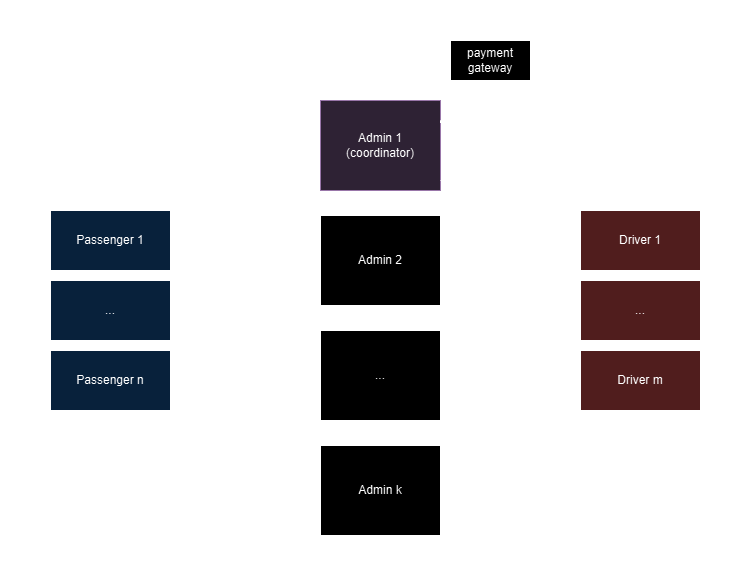
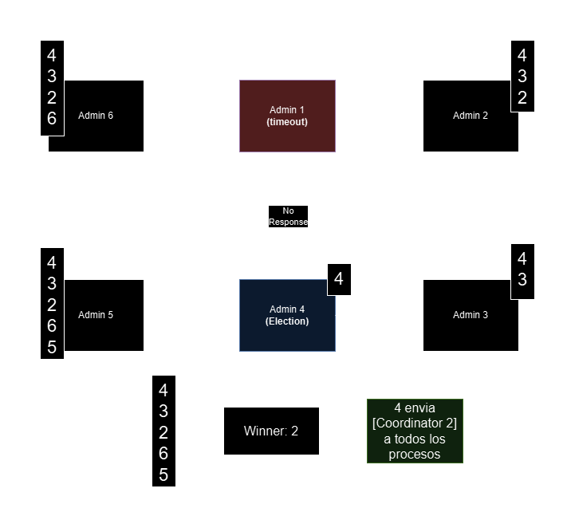
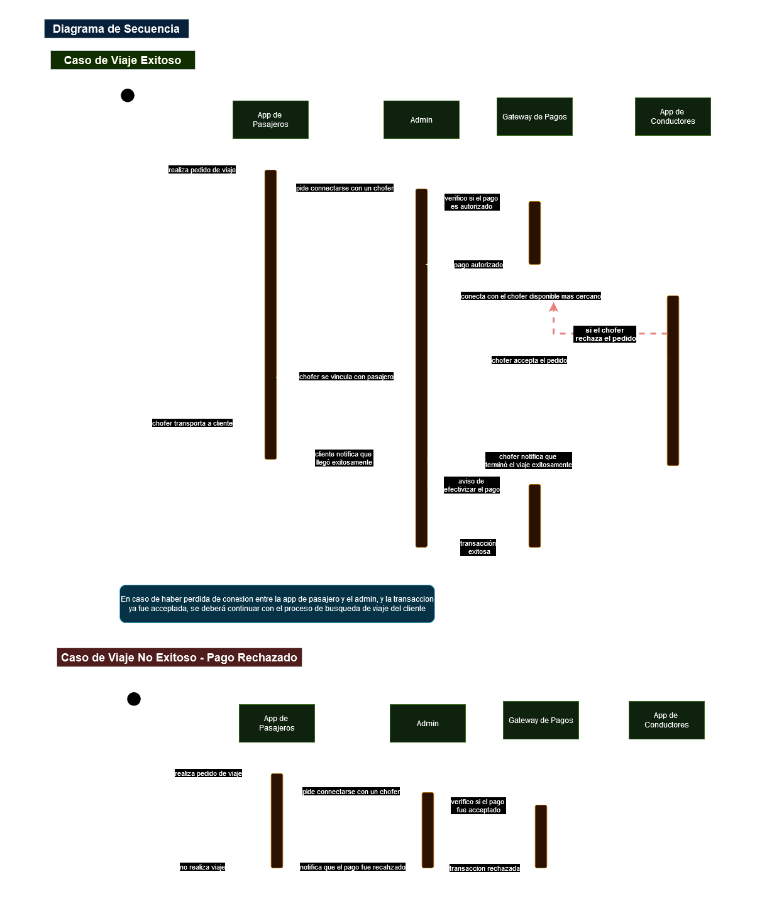
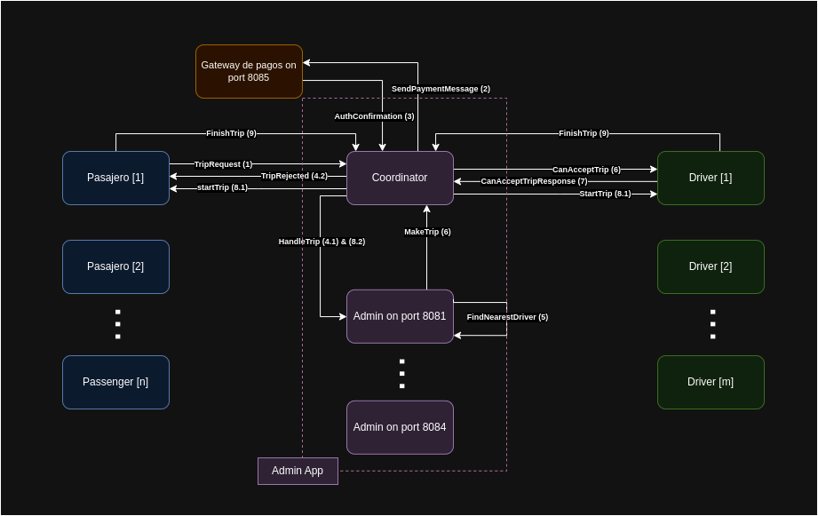
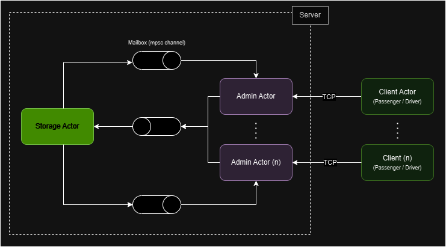

# Programacion Concurrente - 2C2024 - CONCURIDE

**ConcuRide** es un sistema distribuido desarrollado en Rust para conectar pasajeros y conductores de manera eficiente. Combina concurrencia avanzada con técnicas distribuidas para ofrecer una solución robusta y escalable.  

## Características Principales  
- **Modelo de Actores**: Gestión concurrente de mensajes entre las entidades del sistema.  
- **Elección de Coordinador**: Implementación del algoritmo Ring para la coordinación distribuida.  
- **Resiliencia**: Tolerancia a fallos en instancias sin comprometer la funcionalidad global.

ConcuRide es una demostración práctica del potencial de la concurrencia y los sistemas distribuidos en aplicaciones modernas.  

## Integrantes:

- [Santiago Sevitz](https://github.com/SantiSev)
- [Maximo Damian Utrera](https://github.com/maxogod)
- [Nicolas Sanchez](https://github.com/nrsanchezfiuba)

[**Video DEMO:**](https://www.youtube.com/watch?v=8ktItIcETTw&ab_channel=MaxoFiuba)

[](https://www.youtube.com/watch?v=8ktItIcETTw&ab_channel=MaxoFiuba)

**(*) Correcciones en anexo**

## Definicion de las Apps

Definiremos un total de 4 programas independientes:

- Passengers (app de pasajeros)
- Drivers (app de conductores)
- Admin (servidor distribuido de administracion de viajes)
- Payment Gateway (API para procesar pagos)

## App de Pasajeros

- **Finalidad:**
  Una App que consiste en emitir pedidos de viajes, brindando sus coordeanadas de origen y destino, donde la app de administración los atrapará y eventualmente conectara a dichos pasajeros a un chofer.

### Estado interno de un Pasajero

```rust
struct Passenger {
  id: usize,                // ID unico
  origin: (f32, f32),       // Tuplca que indica las coordenadas del pasajero
  destination: (f32, f32),  // Tuplca que indica el destino del pasajero
  on_trip: bool             // Indica si el pasajero actualmente está en un viaje o no,
}
```

## App de Conductores

- **Finalidad:**
  Una app de choferes representa a un conductor activo que recibe solicitudes de viaje desde la app de administración. El conductor puede aceptar o rechazar cada solicitud; al aceptar, es vinculado con un pasajero disponible para realizar el viaje.

### Estado interno de un Conductor

```rust
struct Driver {
  id: usize,              // ID unico
  position: (f32, f32),   // Tuplca que indica las coordenadas del conductor
  available: bool         // Indica si el conductor esta libre a realizar viajes
}
```

## App de Administracion de Viajes

- **Finalidad:**
  Una app que recibe pedidos de pasajeros, verifica su validez a través del gateway de pagos y, si son aprobados, asigna la solicitud al conductor más cercano que la acepte. Es una aplicación distribuida en la que el coordinador se elige mediante el algoritmo Ring. El propósito de la distribucion es garantizar la disponibilidad del sistema, evitando caídas (de todo el sistema) en caso de que un administrador falle.

```rust
struct Admin {
    id: usize,                                            // ID unico
    passenger_handles: HashMap<usize, passanger_handle>,  // Diccionario que guarda los handles de comunicacion con cada pasajero como valor y su id como clave
    driver_handles: HashMap<usize, driver_handle>,        // Diccionario que guarda los handles de comunicacion con cada conductor como valor y su id como clave
}
```

## App de autorizacion de pagos

- **Finalidad:**
  Una app que recibe pedidos y simula el procesamiento de pagos, generando aleatoriamente un valor booleano para determinar si el viaje es aceptado o rechazado. Si el pago es rechazado, el viaje se cancela. De esta manera, se simula un gateway de pagos de terceros.

## Protocolo de Comunicaciones

Todas las aplicaciones establecerán sus comunicaciones mediante el protocolo TCP, garantizando una transmisión de datos confiable y ordenada entre los diferentes componentes del sistema.

## Flujo General del Sistema

En el siguiente grafico se puede ver como se modelan las comunicaciones entre los programas:



Se observa que los pasajeros se conectaran a travez de un socket TCP al admin de ID mas bajo (que deberia ser el coordinador), si este no responde se intentara conectar al siguiente y asi sucesivamente (De esta manera se minimizan los mensajes enviados por la red). Una vez establecida esta comunicacion el Admin coordinador guardara los handles y el id del pasajero en un diccionario para comunicarse en el futuro. Los demas Administradores se comunican con el coordinador para acceder a la lista de pasajeros y choferes para poder vincularlos y empezar un viaje, antes de esto corrobora que se podra hacer el pago con el gateway de pagos. Los conductores por su parte tambien se conectan al coordinador y son guardados en un diccionario para luego ser asignados a un pasajero cercano.

## Muestra de Algoritmo de Elección

Como se mencionó previamente, utilizamos el algoritmo Ring para seleccionar un nuevo coordinador en caso de fallas en el coordinador actual, asegurando la continuidad y estabilidad del sistema distribuido.



En este ejemplo el admin 4 intenta comunicarse con el coordinador del momento y no obtiene respuesta, por lo que inicia una eleccion agregandose a una lista de candidatos y enviando a su antecesor el mensaje Election, este se agrega a la lista y lo envia a su propio antecesor y asi sucesivamente, hasta que se llega al admin 2 quien tampoco obtiene respuesta del admin 1, por lo que le envia Election directamente al admin 6 (formando asi el anillo). Cuando el mensaje Election vuelve a llegar al admin 4 quien fue el que inicio la eleccion, este observa la lista y selecciona el de ID mas bajo (que esta disponible), en este caso el 2, entonces le envia a todos el mensaje Coordinator con el id 2. De esta manera el sistema se recupera de la caida del anterior admin coordinador.

## Diagrama de Secuencia

A continuacion se muestran diagramas que ilustran dos casos comunes en el sistema. Un caso de exito en donde se demuestra una iteracion completa del sistema, desde el momento en el que se solicita un viaje hasta el momento en el que se efectua (pasando por autorizacion del pago, asignacion de conductor y efectivizacion del pago luego de terminado el viaje), y un caso donde no se realiza un viaje debido al rechazo del pago por parte del gateway de pagos.



## Sistema de Mensajes

Los mensajes que se tendran que enviar/recibir en el sistema para su funcinamiento se enumeran y describen en el siguiente cuadro:


## Consideraciones & Casos Bordes

### Consideraciones

- **Simulacion de Viajes:**
  Los viajes se calculan utilizando el módulo de la distancia entre el origen y el destino del pasajero. Para simular el transporte, aplicamos un sleep de 1 segundo multiplicado por esa distancia. En nuestra simulación, el mundo está representado como una cuadrícula de 20x20, lo que establece un tiempo máximo posible de viaje de aproximadamente 30 segundos (correspondiente a la distancia diagonal máxima)

- **Notificación fin de viajes:**
  Cuando se finaliza el viaje, el conductor y el pasajero (no importa quien es el primero) notificará al admin que se finalizó el viaje y se efectuará el pago. El actor que termina segundo, enviará correctamente el mensaje pero no se volverá a efectuar el pago de un viaje ya acreditado.

### Casos Bordes

- **Sin conductores disponibles:** Si un pasajero solicita un viaje y está en la etapa de búsqueda de conductor, deberá esperar a que un conductor se libere para poder asignarlo.
- **Fallo del gateway de pago:** Ante una caída en el gateway de pagos (considerado "software de terceros" en nuestro contexto), se rechazarán todas las solicitudes de viaje gestionadas por el admin hasta que el gateway se restablezca. Se notificará que el problema se debe a un fallo en el gateway.
- **Pérdida de conexión del pasajero antes de la aprobación de la transacción:** El viaje será cancelado automáticamente.
- **Pérdida de conexión del pasajero después de la aprobación de la transacción:** El proceso de búsqueda de un conductor continuará. El conductor notificará al admin sobre la finalización del viaje, asegurando que el pago se efectúe correctamente.
- **Pérdida de conexión del conductor durante el viaje:** El pasajero notificará al admin sobre la finalización del viaje, asegurando que el pago se efectúe correctamente. Además, si el admin recibe primero la notificación por parte del pasajero, automáticamente le envía una notificación al conductor. De esta manera, en el momento que el conductor retome la conexión, al recibir dicha notificación éste pasa a estar disponible, sin tener que esperar a que finalice la simulación del tiempo del viaje que ya había terminado.
- **Pérdida de conexión tanto del pasajero como del conductor:** El viaje no será acreditado hasta que al menos uno de los dos actores se reconecte y notifique al admin la finalización del viaje.

# Anexo | Cambios & nuevas consideraciones

## Estados Internos Nuevos

**Consideraciones Previas:**

- **`TcpSender`**, es un actor de Actix que se encarga de enviar datos a través de un flujo TCP. Específicamente, gestiona la escritura en un canal de comunicación TCP para enviar mensajes.

### Estado interno de un Pasajero y Driver (mismo estado interno)

```rust
pub struct Passenger/Driver {
    servers: Vec<SocketAddr>, // lista de ip de los admins
    reader: Lines<BufReader<OwnedReadHalf>>, // mitad de lectura de tcp stream
    writer: OwnedWriteHalf, // mitad de escritura de tcp stream para la comunicacion con el coordinator
}
```

### Estado Interno de un Admin actor

Encargado de la comunicacion con los clientes y la logica de negocio.

```rust
pub struct Admin {
    /// Dirección de ip de la instancia del Admin.
    pub addr: SocketAddr,
    /// Dirección del cliente que está conectado al Admin.
    pub client_addr: SocketAddr,
    /// Dirección del actor TcpSender para comunicarse con el cliente.
    pub tcp_sender: Arc<Addr<TcpSender>>,
    /// Canal para coordinar elecciones de coordinadores.
    pub coordinator_election: CoordElection,
    /// Dirección del Coordinator actor.
    pub coordinator: Arc<Addr<Coordinator>>,
    /// Dirección del actor Storage para mantener los pasajeros y conductores
    pub storage_addr: Arc<Addr<Storage>>,
}
```

### Estado Interno del Storage actor

Encargado de la lectura y escritura ordenada de los diccionarios de clientes.

```rust
pub struct PassengerEntity {
    /// Posición actual del pasajero en coordenadas 2D.
    pub passenger_position: (f32, f32),
    /// Destino del pasajero en coordenadas 2D.
    pub passenger_destination: (f32, f32),
    /// Dirección del actor TcpSender para comunicarse con el pasajero.
    pub passenger_sender: Option<Arc<Addr<TcpSender>>>,
}

pub struct DriverEntity {
    /// Posición actual del conductor en coordenadas 2D.
    pub driver_position: (f32, f32),
    /// Dirección del pasajero actual asociado con el conductor (si existe).
    pub current_passenger_id: Option<SocketAddr>,
    /// Dirección del actor TcpSender para comunicarse con el conductor.
    pub driver_sender: Option<Arc<Addr<TcpSender>>>,
    /// Estado actual del conductor.
    pub status: DriverStatus,
    /// Marca de tiempo que registra la última actualización del conductor.
    pub time_stamp: Instant,
}

pub struct Storage {
    /// Diccionario con informacion sobre pasajeros
    pub passengers: HashMap<SocketAddr, PassengerEntity>,
    /// Diccionario con informacion sobre conductores
    pub drivers: HashMap<SocketAddr, DriverEntity>,
}
```

### Estado Interno de Election actor

Encargado del algoritmo de eleccion de coordinador (ring).

```rust
pub struct CoordinatorElection {
    /// Direccion de ip de la instancia del admin.
    pub id: SocketAddr,
    /// Direccion de ip del coordinador actor.
    pub coordinator_id: Option<SocketAddr>,
    /// Direccion del coordinator actor.
    pub coordinator: Arc<Addr<Coordinator>>,
    /// Lista de admin peers.
    pub peers: Arc<Vec<SocketAddr>>,
    /// Estado de eleccion.
    pub in_election: bool,
}
```

### Estado Interno de Coordinator actor

Encargado de la comunicacion entre el coordinador y los demas admin. Se usa para notificar updates de los nuevos clientes, y para delegar la creacion de viajes.

```rust
pub struct Coordinator {
    /// Direccion de ip de la instancia del admin.
    pub addr: SocketAddr,
    /// Lista de ip de admin peers.
    pub peers: Vec<SocketAddr>,
    /// Acceso a los TcpSenders de cada peer para el envio de mensajes (updates y pedidos de viaje).
    pub peer_handles: Peers,
    /// Contador para balancear los pedidos de viaje entre los admins de manera round robin
    pub peer_counter: u8,
}
```

### Estado Interno de la App Autorizacion de Pagos

Encargado de la autorizacion y efectivizacion de pagos.

```rust
pub struct PaymentGateway {
    /// Dirección del actor TcpSender para comunicarse con el coordinador.
    tcp_sender: Arc<Addr<TcpSender>>,
    /// Dirección del socket donde el Payment Gateway está bindeado para recibir solicitudes.
    pub addr: SocketAddr,
}
```

## Flujo de Mensajes & Estructura Interna
A continuacion mostraremos una secuencia de mensajes indicando el **orden**, y la **direccion** de envio del mensaje
Para nuestro Projecto, decidimos implementar 5 servidores distribuidos de `Admins`, entre los 5 admins, 1 de ellos será el coordinador encargado de comunicarse entre todos los admins, pasajeros, drivers y el payment gateway




### Definicion de cada mensaje
- TripRequest (1):
El pasajero envía una solicitud al App de Admin para iniciar un viaje, incluyendo su ubicación y destino. El receptor es el Coordinador

- SendPaymentMessage (2):
El Coordinador contacta al Gateway de pagos para verificar el pago relacionado con la solicitud del pasajero.

- AuthConfirmation (3):
El Gateway de pagos responde al Coordinador confirmando o rechazando la autorización del pago, o notificando que se efectivizo el pago (al terminar el viaje).

- HandleTrip (4.1):
En caso de éxito, el Coordinador comunica a un Admin _(A traves del metodo de eleccion de Round Robin)_ la tarea de manejar la solicitud del viaje.

- TripRejected (4.2):
Si el Gateway de pago rechaza la auth del pasajero, finaliza su viaje

- FindNearestDriver (5):
El Admin localiza al conductor más cercano & Disponible (conductores con el status seteado como Active) al pasajero y lo selecciona para realizar el viaje.

- MakeTrip (6):
El Admin informa al Coordinador sobre el conductor y el pasajero elegido para el viaje.

- CanAcceptTrip (7):
El Coordinador pregunta al conductor si puede aceptar la solicitud del viaje. El conductor cambia su estado a Waiting(*)

- CanAcceptTripResponse (8):
El conductor responde al Coordinador indicando si acepta o no la solicitud.

- StartTrip (9.1):
Si el conductor acepta, el Coordinador notifica al pasajero y al conductor que pueden iniciar el viaje. El drvier cambia su estatus a OnTrip y no podra tomar solicitudes de viaje hasta finalizar su viaje

- HandleTrip (9.2):
Si el conductor rechaza la solicitudo, vuelve a enviar un mensaje HandleTrip (4.1) al proximo admin que pueda manejar la solicitud del pasajero.

- FinishTrip (10)
Cuando el pasajero o conductor finaliza su viaje, notifica al coordinador (no importa quien lo envie primero solo importa que uno de los 2 lo envie primero ). Cuando el coordinador recepciona el mensaje de FinishTrip, finaliza el viaje para el driver y pasanger. El driver queda con su status como Active denuevo

## (*) Driver Reaper
Para casos cuando el coordinador envia un mensaje de CanAcceptTrip al Driver y el Driver no contesta más. Decidimos implementar un sistema de Reaper donde en un periodo de tiempo, el coordinador ejecuta un `Reaper` encargado en eliminar a los drivers que nunca contestaron al coordinator en un periodo de tiempo. El passenger que fue originalmente vinculado a ese driver, será nuevamente vinculado con un driver nuevo.

## Flujo entre Admin y Storage actor

Como se mencionara en el siguiente segmento de correcciones se ha añadido un nuevo actor para mantener la informacion de los clientes de forma segura (su estado interno se demostro en su respectiva seccion del readme). A continuacion se puede observar un diagrama a grandes razgos de la comunicacion entre admin y storage.



# Correcciones

Se realizaron las siguientes correcciones (y se corrigio el presente anexo):

* Ya no hay un servidor designado como coordinador por default, sino que todo servidor al iniciarse, pregunta por única vez si ya hay un coordinador. Si no obtiene respuesta, este se proclama coordinador (y notifica al resto). Por lo tanto si se iniciara otro servidor, este al realizar la misma acción, detecta al coordinador y comienza a pingearlo periodicamente para confirmar su actividad en ambos sentidos. Si el servidor coordinador pierde conexion o se cae, comienza una elección, y mediante el algoritmo de ring se nombra coordinador al candidato con menor numero de puerto.
* Los clientes, tanto el pasajero como el conductor, buscan conectarse directamente con el coordinador, preguntando a los servidores quién lo es (por medio del mensaje WhoIsCoordinator).
* Los clientes, tanto el pasajero como el conductor, si se encuentran en el transcurso del viaje (estado ocupado), y el servidor que estaba administrando el viaje y esperando una respuesta se cae o pierde la conexión, al finalizar el viaje, las aplicaciones de los clientes envían su mensaje de "viaje finalizado", pero esperan un aviso de "acknowledge" por parte del servidor. En caso de no recibirlo (coordinador caído), preguntan quien es el nuevo coordinador y le envían el mensaje de "viaje finalizado" al mismo, de esta manera no se pierde el correspondiente pago del viaje.
* Se eliminó el uso de locks en el actor de Admin, que antes se utilizaban para acceder y modificar la información de los pasajeros y conductores. Ahora se utiliza un actor llamado Storage.
* Se agregó un actor denominado Storage, que es el responsable de manejar correctamente la información que utilizan los servidores sobre los pasajeros y conductores. De esta manera, mediante el sistema de mensajería de actores, coordina el acceso y la modificación de esta información, evitando problemas de concurrencia, como las posibles race conditions.
* Se eliminó el uso de locks en el actor de Election. Todos los critical sections se manejan mediante mensajes internos del actor CoordinatorElection, entonces el acceso y la modificación estarán ordenados por el mailbox del actor. Por ejemplo la lectura y escritura del atributo coordinator_id.
* Se eliminó el uso de locks en el actor Coordinator. De la misma forma que en Election, mediante el uso de mensajes internos de actor, se puede leer el map de peers o agregar un nuevo peer al map. De esta manera, se evitan problemas de concurrencia.

## Demo de funcionamiento del sistema y sus casos bordes

* [Video demo](https://www.youtube.com/watch?v=8ktItIcETTw&ab_channel=MaxoFiuba)

# How to use

## 1. Startup Payment Gateway
Para inicializar el payment gateway se debe ejecutar el siguiente commando:
```
cargo run -p payment
```
Para nuestro proyecto, decidimos reservar el puerto `8085` exclusivamente para el payment gateway

## 2. Startup Admin
```
cargo run -p admin 8084
```
Para nuestro proyecto, decidimos reservar los puerto `8080` a `8084` exclusivamente para los admin

Decidimos utilizar un sistema distribuido compuesto por 4 admins y 1 admin coordinador

Inicializar el admin sin flags hara que se revelen todos los logs relacionado con eleccions y viajes

### Startup Admin con Flags

```
cargo run --features election_logs --bin admin 8080
```
Inicializa a un admin con logs relacionado con elections
```
cargo run --features trip_logs --bin admin 8080
```
Inicializa a un admin con logs relacionado con viajes

## 3. Startup Passenger

```
cargo run -p passenger
```
Ejecuta una instancia de Pasajero (luego de realizado y finalizado un viaje este debera ser terminado [ctrl + c])

## 4. Startup Driver
```
cargo run -p driver
```
Ejecuta una instancia de Driver

## Ejecutables de Bash:

Se crearon varios ejecutables en la carpeta ubicada en la raiz ```/executables/```, donde despliega el conjunto de terminales automáticamente dependiendo del caso a evaluar. Se explica en cada archivo el comportamiento de cada ejecutable, de esta manera es mas fácil comprobar los comportamientos mostrados por los logs en sus terminales, dependiendo del tipo de logs elegidos si quiere mostrarse los logs de elecciones en los admin, o los logs relacionados con los viajes y las interacciones entre servidor-cliente.
* ```election_admins.sh``` lanza solo los 5 admins y se muestran los logs relacionados con las elecciones dentro de los admin (con ctrl + c se puede cerrar el coordinador para ver el proceso de eleccion).
* ```trip_admins.sh``` lanza el gateway de pagos y los 5 admins con los logs activados relacionados con los viajes y las interacciones con sus clientes (lanzar clientes manualmente para probar viajes).
* ```many_clients.sh``` lanza 6 conductores y 10 pasajeros que intentarán conectarse a los servidores (usar en conjuncion con trip_admins.sh).
* ```trips_complete.sh``` lanza el gateway de pagos, los admin y luego de un tiempo lanza 6 conductores y 10 pasajeros. Como este script lanza cada uno en una terminal separada se recomienda usar trip_admins + many_clients.

